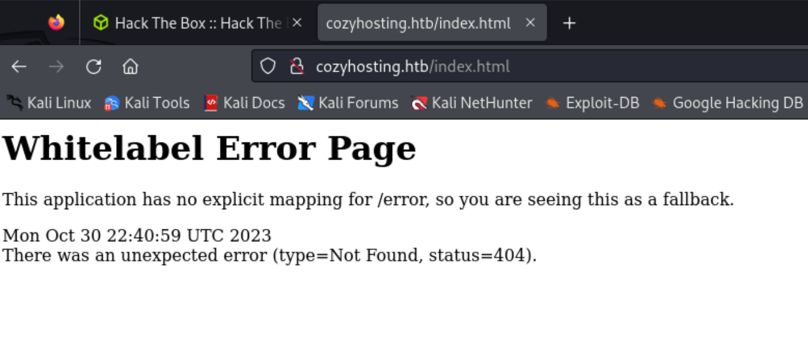
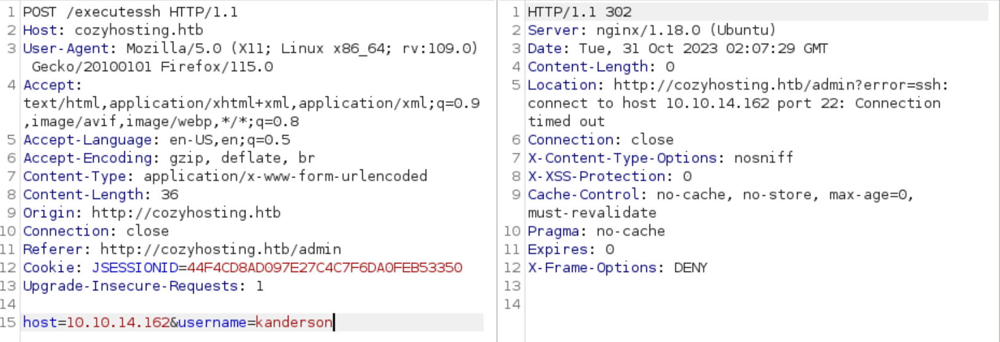

+++
tags = ["HTB", "RCE", "Linux", "BootStrap", "SpringBoot", "HTTP", "SSH", "SessionHijacking"]
title = "Cozy Hosting Walkthrough"
weight = 10
+++


&nbsp;
&nbsp;

## Recon
#### NMAP

Typically the first thing I always do on a box is run an ```nmap``` scan with ```-sC``` to run the default set of NSE scripts and ```-sV``` to run service version detection.


&nbsp;

Port 22-SSH and port 80-HTTP are open. I'll then update my hosts file to include CozyHosting's IP and URL, because the scan says it could not follow the redirect to the box's URL.


#### Subdomain Fuzz and the Website

Knowing this host contains a website the first thing I wanted to do was find out what URLs it had. I originally spidered the website with ZAP, but didn't come up with many URL's because ZAP needs to be authenticated to spider the site any farther. 

I moved onto seeing if I could find a targeted SecList to use instead of trying semi-random lists until I stumbled upon the right one.

Opening the web page you notice a few things, but mostly I noticed that there was a link to ```/index``` on the site icon. 

 

```/index``` displays a "Whitelable Error Page". 



If you search this "Whitelable Error Page" you find that the website is running on Spring Boot. Spring Boot is an open source Java-based framework used to build stand-alone and production ready spring applications according to [Tutorials Point](https://www.tutorialspoint.com/spring_boot/spring_boot_introduction.htm).

Looking through SecLists I see that I have a list for Spring Boot applications. 

Using Dirb and the [SecList](https://github.com/danielmiessler/SecLists/blob/master/Discovery/Web-Content/spring-boot.txt) for Spring Boot I discovered a lot more pages than before. 

```dirb http://cozyhosting.htb/ /usr/share/SecLists/Discovery/Web-Content/spring-boot.txt```


Navigating to the first interesting URL, ```/actuator/sessions```, leads me to find user **kanderson** and an alpha numeric string.


Throwing the string into [CyberChef](https://gchq.github.io/CyberChef/) yeilded nothing. But then after enumerating a few unsucessful users I saw the site was storing session cookies. 


After pasting the session cookie from ```/actuator/sessions``` onto my existing unautherises session cookie I was able to refresh the page and log in as **K. Anderson**. 


After trying a few unsucessful attempts at adding a host to automatic patching and different ways of getting a shell there. I opened Burp to see what the form was actually doing. 

When running the connection settings form I saw that it was actually trying to execute an SSH command.



After I realized it was running a command I tried a few command injections and came back with the usage syntax for SSH realizing that it was infact running commands in ```/bin/bash```. 


