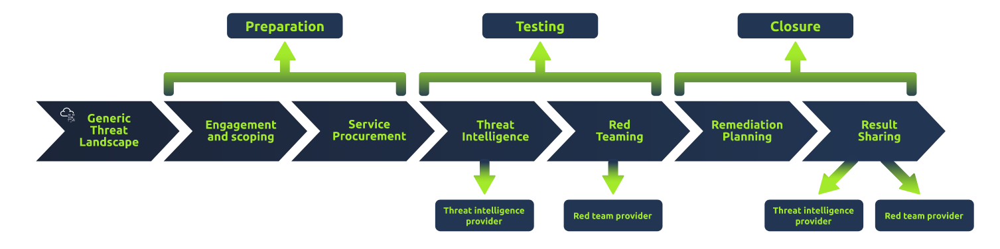

+++
tags = ["TryHackMe", "Red Team", "Threat Intel"]
title = "Red Team Threat Intel - TryHackMe"
weight = 10
draft = true
images = [ "/walkthroughs/Red Team Threat Intel/logo.png" ]
description = "Apply threat intelligence to red team engagements and adversary emulation."
+++

Date written: January 2024      
Date published: January 2024

## Task 1: Introduction 

Room objectives:
- Understand the basics of threat intelligence and how it can be applied to red team engagements
- Learn how to create a threat-intel-driven campaign.
- Use frameworks to understand concepts and leverage threat intelligence.

Threat Intelligence (TI) or Cyber Threat Intelligence (CTI) is the information, or TTPs (Tactics, Techniques, and Procedures), attributed to an adversary, commonly used by defenders to aid in detection measures. The red cell can leverage CTI from an offensive perspective to assist in adversary emulation.

> Read the above and continue to the next task.
> 
> Answer: No answer needed

## Task 2: What is Threat Intelligence

Expanding upon task 1, CTI can be consumed (to taken action upon data) by collecting IOCs (Indicators of Compromise) and TTPs commonly distributed and maintained by ISACs (Information and Sharing Analysis Centers). Intelligence platforms and frameworks also aid in the consumption of CTI, primarily focusing on an overarching timeline of all activities.

Note: The term ISAC is used loosely in the threat intelligence landscape and often refers to a threat intelligence platform.

Traditionally, defenders use threat intelligence to provide context to the ever-changing threat landscape and quantify findings. IOCs are quantified by traces left by adversaries such as domains, IPs, files, strings, etc. The blue team can utilize various IOCs to build detections and analyze behavior. From a red team perspective, you can think of threat intelligence as the red team's analysis of the blue team's ability to properly leverage CTI for detections.

In this room, we will be focusing on APT (Advanced Persistent Threat) activity and how to leverage their documented TTPs. The next task will detail the specifics of threat intelligence and its significance to the red team.

> Read the above and continue to the next task.
> 
> Answer: No answer needed. 

## Task 3: Applying Threat Intel to the Red Team 

As previously mentioned, the red team will leverage CTI to aid in adversary emulation and support evidence of an adversary's behaviors.

To aid in consuming CTI and collecting TTPs, red teams will often use threat intelligence platforms and frameworks such as MITRE ATT&CK, TIBER-EU, and OST Map.

These cyber frameworks will collect known TTPs and categorize them based on varying characteristics such as,

    1. Threat Group
    2. Kill Chain Phase
    3. Tactic
    4. Objective/Goal

Once a targeted adversary is selected, the goal is to identify all TTPs categorized with that chosen adversary and map them to a known cyber kill chain. This concept is covered further in the next task.

Leveraging TTPs is used as a planning technique rather than something a team will focus on during engagement execution. Depending on the size of the team, a CTI team or threat intelligence operator may be employed to gather TTPs for the red team. During the execution of an engagement, the red team will use threat intelligence to craft tooling, modify traffic and behavior, and emulate the targeted adversary. This concept is covered further in task 5.

Overall the red team consumes threat intelligence to analyze and emulate the behaviors of adversaries through collected TTPs and IOCs.

> Read the above and continue to the next task.
> 
> Answer: No answer needed. 

## Task 4: The TIBER-EU Framework  

TIBER-EU (Threat Intelligence-based Ethical Red Teaming) is a common framework developed by the European Central Bank that centers around the use of threat intelligence.

The main difference between this framework and others is the "Testing" phase that requires threat intelligence to feed the red team's testing.

This framework encompasses a best practice rather than anything actionable from a red team perspective.

> Read the above and continue to the next task.
> 
> Answer: No answer needed. 

## Task 5: TTP Mapping 